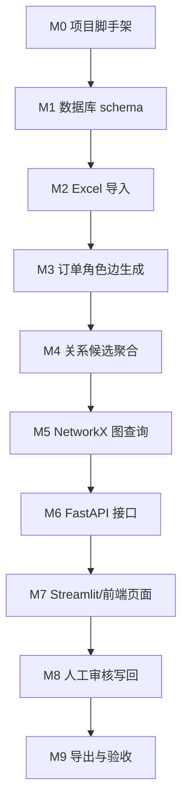

# 企业关系图谱 MVP 研发任务拆解

> 基于文档：`企业关系图谱系统_PRD.md`  
> 版本：V0.1  
> 日期：2026-05-22  
> 推荐 GitHub 仓库名：`trade-entity-graph`  
> MVP 技术路线：SQLite/PostgreSQL + 关系型边表 + NetworkX + FastAPI + Streamlit/React 图谱页面

---

## 1. MVP 目标

本 MVP 的目标不是一次性建设完整图数据库系统，而是先在本地机器上搭建一套低成本、可运行、可验证的企业关系图谱原型。

MVP 必须完成以下闭环：

1. 导入当前项目已有订单分析结果和企业清洗结果；
2. 建立企业主体、企业别名、订单证据、订单角色关系和关系候选；
3. 使用关系型边表保存企业之间的订单角色关系和最终关系；
4. 使用 NetworkX 完成中心企业一跳关系、二跳关系和路径计算；
5. 支持搜索企业主体并展示以其为中心的关系网络；
6. 支持点击关系查看订单证据；
7. 支持人工确认、否定、修改、人工新增关系；
8. 人工确认结果写入最终关系表；
9. 支持导出中心企业关系明细；
10. 所有人工操作和最终关系可追溯。

---

## 2. MVP 技术范围

## 2.1 采用方案

| 模块 | MVP 选择 | 说明 |
| --- | --- | --- |
| 数据处理 | Python + Pandas/Polars | 处理 Excel/CSV、生成标准化数据和边表 |
| 关系存储 | SQLite 优先，PostgreSQL 可选 | 本地 MVP 优先 SQLite；多人使用或权限要求提高后切 PostgreSQL |
| 图查询 | 关系型边表 + NetworkX | 不单独部署 Neo4j，先用 Python 图计算 |
| 后端 API | FastAPI | 提供搜索、图谱、关系详情、审核写入、导出接口 |
| 前端页面 | Streamlit 优先，React 可选 | 本地验证建议 Streamlit；若直接产品化可用 React + 图谱组件 |
| 导出 | Excel/CSV | 导出关系明细、节点、边和审核结果 |

## 2.2 不纳入 MVP

- 不部署 Neo4j、FalkorDB、CozoDB 等专用图数据库；
- 不做完整权限体系，只保留操作人字段和基础审计；
- 不做公网自动验证爬虫；
- 不做 CRM/BI/飞书正式集成；
- 不做复杂社区发现和全图实时算法；
- 不做生产级多租户、多用户并发和高可用部署。

---

## 3. 推荐项目名称

## 3.1 推荐 GitHub 仓库名

```text
trade-entity-graph
```

推荐理由：

- `trade`：体现订单、贸易、商流、货物流向场景；
- `entity`：强调企业主体、别名、主体关系管理；
- `graph`：体现关系网络和图谱能力；
- 名称中性，未来不局限于海运，也可扩展到空运、陆运、供应链或 CRM 关系；
- 全小写短横线格式，适合作为 GitHub 仓库名称。

## 3.2 备选名称

| 仓库名 | 适合场景 |
| --- | --- |
| `trade-entity-graph` | 推荐，通用、清晰、可扩展 |
| `cargo-relgraph` | 更偏海运/物流订单场景，短但业务范围更窄 |
| `customer-relgraph` | 更偏客户关系和销售机会场景 |
| `order-relation-graph` | 更强调订单关系证据层 |
| `biz-relgraph` | 更短，但含义略泛 |

后续文档默认以 `trade-entity-graph` 作为项目名。

---

## 4. MVP 里程碑拆解

| 阶段 | 名称 | 目标 | 建议周期 |
| --- | --- | --- | --- |
| M0 | 项目脚手架与基础规范 | 搭建本地可运行项目骨架 | 0.5-1 天 |
| M1 | 数据模型与本地数据库 | 建立核心表和初始化脚本 | 1-2 天 |
| M2 | 数据导入与关系边生成 | 导入 Excel，生成主体、证据、边和候选关系 | 2-4 天 |
| M3 | 图查询与 NetworkX 服务 | 支持一跳、二跳、路径和图谱 JSON 输出 | 1-2 天 |
| M4 | API 服务 | 提供搜索、图谱、详情、审核、导出接口 | 2-3 天 |
| M5 | MVP 页面 | 搜索企业、展示关系图、查看证据、人工审核 | 3-5 天 |
| M6 | 导出、验收与演示数据 | 完成导出、测试、README 和演示流程 | 1-2 天 |

建议 MVP 总周期：约 10-17 个工作日，取决于是否使用 Streamlit 快速页面，还是直接做 React 页面。

---

## 5. 建议仓库结构

```text
trade-entity-graph/
  README.md
  pyproject.toml 或 requirements.txt
  .env.example
  data/
    raw/
    processed/
    exports/
  docs/
    PRD.md
    MVP研发任务拆解.md
    数据字典.md
  src/
    trade_entity_graph/
      __init__.py
      config.py
      db/
        connection.py
        schema.sql
        migrations/
      importers/
        excel_importer.py
        entity_loader.py
        relationship_loader.py
      services/
        entity_service.py
        relationship_service.py
        graph_service.py
        review_service.py
        export_service.py
      api/
        main.py
        routers/
          entities.py
          relationships.py
          graph.py
          reviews.py
          imports.py
          exports.py
      ui/
        streamlit_app.py
      utils/
        normalization.py
        ids.py
        logging.py
  tests/
    test_importer.py
    test_graph_service.py
    test_review_service.py
  scripts/
    init_db.py
    import_workbook.py
    run_api.py
    run_ui.py
```

MVP 如果追求速度，可以先不拆太细，但建议至少保留：

```text
src/
  db/
  importers/
  services/
  api/
  ui/
```

---

## 6. 数据库任务拆解

## 6.1 核心表实现

| 任务 ID | 任务 | 优先级 | 产出 | 验收标准 |
| --- | --- | --- | --- | --- |
| DB-01 | 设计并创建 `entity` 表 | P0 | `schema.sql` | 可保存企业主体、国家、标签、状态 |
| DB-02 | 设计并创建 `entity_alias` 表 | P0 | `schema.sql` | 可通过原始名、清洗名、别名关联到 `entity_id` |
| DB-03 | 设计并创建 `order_evidence` 表 | P0 | `schema.sql` | 可追溯订单号、源文件、源 sheet、源行号、TEU、目的地、产品 |
| DB-04 | 设计并创建 `order_role_edge` 表 | P0 | `schema.sql` | 可保存下单客户->通知人等订单角色关系 |
| DB-05 | 设计并创建 `relationship_claim` 表 | P0 | `schema.sql` | 可保存系统生成的关系候选 |
| DB-06 | 设计并创建 `curated_relationship` 表 | P0 | `schema.sql` | 可保存人工确认、否定、人工新增的最终关系 |
| DB-07 | 设计并创建 `relationship_decision` 表 | P0 | `schema.sql` | 可记录每次人工操作的前后状态和理由 |
| DB-08 | 设计并创建 `import_batch` 表 | P0 | `schema.sql` | 每次导入有唯一 `run_id`，可追溯规则版本和源文件 |
| DB-09 | 设计并创建 `audit_log` 表 | P1 | `schema.sql` | 关键操作可记录操作人、时间、对象和动作 |
| DB-10 | 添加常用索引 | P0 | `schema.sql` | 企业搜索、边查询、关系详情查询响应可接受 |

## 6.2 建议主键规则

| 对象 | ID 示例 | 生成方式 |
| --- | --- | --- |
| 企业主体 | `ENT_000001` | 导入时递增或基于规范名哈希 |
| 企业别名 | `ALIAS_000001` | 递增 |
| 订单证据 | `OE_000001` | 递增或 `run_id + row_no` |
| 订单角色边 | `ORE_000001` | 递增 |
| 关系候选 | `RC_000001` | `entity_a + entity_b + relation_type` 聚合后生成 |
| 最终关系 | `REL_000001` | 人工确认或人工新增时生成 |
| 人工决策 | `DEC_000001` | 递增 |
| 导入批次 | `RUN_20260522_001` | 时间戳 + 序号 |

---

## 7. 数据导入任务拆解

## 7.1 文件导入

| 任务 ID | 任务 | 优先级 | 说明 | 验收标准 |
| --- | --- | --- | --- | --- |
| IMP-01 | 支持读取订单标准化明细 Excel | P0 | 读取当前项目已有分析结果 | 能识别 sheet 并读取行数 |
| IMP-02 | 支持读取企业清洗结果 | P0 | 导入标准名、原始名、实体 ID | 原始名可映射到 `entity_id` |
| IMP-03 | 支持读取关系候选结果 | P0 | 导入已有 `entity_relationship` 类结果 | 可生成 `relationship_claim` |
| IMP-04 | 支持字段映射配置 | P1 | 字段名变化时通过配置适配 | 不改代码可调整核心字段名 |
| IMP-05 | 生成导入批次 `run_id` | P0 | 每次导入写入 `import_batch` | 可按 `run_id` 查询导入结果 |
| IMP-06 | 记录异常行 | P1 | 字段缺失、企业无法匹配、TEU 异常 | 异常可导出复核 |

## 7.2 订单角色边生成

| 任务 ID | 任务 | 优先级 | 说明 | 验收标准 |
| --- | --- | --- | --- | --- |
| EDGE-01 | 生成下单客户 -> 发货人边 | P0 | `customer_to_shipper` | 边表有对应记录和订单证据 |
| EDGE-02 | 生成下单客户 -> 收货人边 | P0 | `customer_to_consignee` | 边表有对应记录和订单证据 |
| EDGE-03 | 生成下单客户 -> 通知人边 | P0 | `customer_to_notify` | 支持用户关注的核心关系 |
| EDGE-04 | 生成发货人 -> 收货人边 | P0 | `shipper_to_consignee` | 可展示供应链流向 |
| EDGE-05 | 生成发货人 -> 通知人边 | P1 | `shipper_to_notify` | 可作为辅助证据 |
| EDGE-06 | 生成收货人 -> 通知人边 | P1 | `consignee_to_notify` | 可作为辅助证据 |
| EDGE-07 | 排除无效主体和占位符 | P0 | 排除 SAME AS、TO ORDER、YQN 等 | 不生成无意义边 |
| EDGE-08 | 聚合企业对关系统计 | P0 | 订单数、TEU、目的国、产品 | 可支持关系详情页展示 |

---

## 8. 关系候选与最终关系任务拆解

## 8.1 关系候选

| 任务 ID | 任务 | 优先级 | 说明 | 验收标准 |
| --- | --- | --- | --- | --- |
| REL-01 | 基于订单角色边生成关系候选 | P0 | 从边表聚合企业对 | 相同企业对可聚合成一条候选 |
| REL-02 | 支持候选关系类型枚举 | P0 | `trading_partner_candidate`、`factory_candidate` 等 | 候选关系类型受控 |
| REL-03 | 计算基础置信度 | P0 | 基于订单数、TEU、角色权重 | 每条候选有分数或高/中/低 |
| REL-04 | 生成候选推荐理由 | P0 | 例如订单数、TEU、目的国、产品信号 | 前端可展示“为什么推荐” |
| REL-05 | 保留已否定关系反证 | P1 | 若同类关系已 rejected，不自动覆盖 | 再次出现时进入复核而非确认 |

## 8.2 最终关系

| 任务 ID | 任务 | 优先级 | 说明 | 验收标准 |
| --- | --- | --- | --- | --- |
| CUR-01 | 确认候选关系 | P0 | 从 `relationship_claim` 生成 `curated_relationship` | 状态写为 `verified` |
| CUR-02 | 否定候选关系 | P0 | 写入 `rejected` 最终关系或决策记录 | 被否定关系不物理删除 |
| CUR-03 | 修改关系类型 | P0 | 将候选类型改为人工判断类型 | 前后类型写入决策记录 |
| CUR-04 | 人工新增关系 | P0 | 没有候选也可新增最终关系 | 可标记为 `manual_only` |
| CUR-05 | 补充人工备注和证据 | P1 | 支持填写原因、来源、链接 | 关系详情可查看补充信息 |
| CUR-06 | 审计日志写入 | P0 | 确认、否定、修改、新增均写日志 | 可追溯操作人和时间 |

---

## 9. 图查询任务拆解

## 9.1 NetworkX 图服务

| 任务 ID | 任务 | 优先级 | 说明 | 验收标准 |
| --- | --- | --- | --- | --- |
| GRAPH-01 | 从数据库边表构建 NetworkX 图 | P0 | 读取 `order_role_edge` 和 `curated_relationship` | 可生成节点和边对象 |
| GRAPH-02 | 获取中心企业一跳关系 | P0 | 返回中心企业直接相连节点和边 | API 返回 nodes/edges JSON |
| GRAPH-03 | 获取中心企业二跳关系 | P1 | 按需展开二跳，限制节点数 | 超过阈值时提示增加筛选 |
| GRAPH-04 | 查询 A 到 C 的路径 | P1 | 使用 shortest path 或 all simple paths 限制深度 | 可返回路径节点和边 |
| GRAPH-05 | 支持边类型过滤 | P0 | 订单角色边、候选关系、最终关系 | 前端可切换展示模式 |
| GRAPH-06 | 支持状态过滤 | P0 | candidate、verified、rejected、pending_verify | 默认隐藏 rejected |
| GRAPH-07 | 支持统计图谱摘要 | P1 | 节点数、边数、订单数、TEU | 图谱页展示概览 |

## 9.2 图谱数据结构

API 输出建议采用：

```json
{
  "center_entity_id": "ENT_000001",
  "nodes": [
    {
      "id": "ENT_000001",
      "label": "Company A",
      "entity_type": "customer",
      "tags": ["重点客户"],
      "order_count": 12
    }
  ],
  "edges": [
    {
      "id": "REL_000001",
      "source": "ENT_000001",
      "target": "ENT_000002",
      "edge_type": "curated_relationship",
      "relation_type": "trading_partner",
      "status": "verified",
      "order_count": 8,
      "teu": 42
    }
  ]
}
```

---

## 10. API 任务拆解

| 任务 ID | API | 方法 | 优先级 | 验收标准 |
| --- | --- | --- | --- | --- |
| API-01 | `/health` | GET | P0 | 返回服务状态 |
| API-02 | `/entities/search?q=` | GET | P0 | 可按标准名、别名、原始名搜索企业 |
| API-03 | `/entities/{entity_id}` | GET | P0 | 返回企业详情、别名、标签、订单统计 |
| API-04 | `/entities/{entity_id}/neighbors` | GET | P0 | 返回一跳关系 |
| API-05 | `/entities/{entity_id}/ego-graph` | GET | P0 | 返回中心企业图谱 nodes/edges |
| API-06 | `/relationships/{relationship_id}` | GET | P0 | 返回关系详情 |
| API-07 | `/relationships/{relationship_id}/evidence` | GET | P0 | 返回订单证据和人工记录 |
| API-08 | `/relationships/{relationship_id}/decision` | POST | P0 | 支持确认、否定、修改关系 |
| API-09 | `/relationships/manual` | POST | P0 | 支持人工新增关系 |
| API-10 | `/paths?from=&to=` | GET | P1 | 返回 A 到 C 的关系路径 |
| API-11 | `/imports` | GET | P1 | 查看导入批次 |
| API-12 | `/exports/relationships` | POST | P0 | 导出关系明细 Excel/CSV |

---

## 11. 前端页面任务拆解

## 11.1 MVP 页面选择

建议第一版使用 Streamlit，原因：

- 本地启动快；
- 对 Python 数据处理和 NetworkX 集成友好；
- 适合先验证数据模型、审核流程和图谱展示；
- 后续确认需求稳定后，再迁移到 React。

如果希望一开始就做给多人长期使用的产品化页面，则直接选择 React + AntV G6 或 Cytoscape.js。

## 11.2 页面任务

| 任务 ID | 页面/模块 | 优先级 | 功能 | 验收标准 |
| --- | --- | --- | --- | --- |
| UI-01 | 首页/导入页 | P0 | 选择文件、触发导入、查看导入结果 | 可导入一批 Excel 并显示成功/异常数量 |
| UI-02 | 企业搜索页 | P0 | 输入企业名，展示匹配主体 | 可选择中心企业进入图谱页 |
| UI-03 | 企业详情页 | P0 | 展示主体信息、别名、订单统计、关系统计 | 信息来自数据库 |
| UI-04 | 关系图谱页 | P0 | 展示中心企业一跳图谱 | 节点和边可视化展示 |
| UI-05 | 图谱筛选器 | P0 | 按关系类型、状态、边类型过滤 | 默认隐藏 rejected |
| UI-06 | 关系详情面板 | P0 | 点击边展示关系详情和证据摘要 | 可看到订单数、TEU、角色组合 |
| UI-07 | 订单证据表 | P0 | 展示关系背后的订单明细 | 可追溯订单号、源文件、源行号 |
| UI-08 | 人工审核表单 | P0 | 确认、否定、修改关系类型、备注 | 提交后写入最终关系和审计日志 |
| UI-09 | 人工新增关系表单 | P0 | 选择两个企业并新增关系 | 新增关系状态为 `manual_only` 或 `verified` |
| UI-10 | 导出按钮 | P0 | 导出当前中心企业关系明细 | 生成 Excel/CSV 文件 |
| UI-11 | 二跳展开 | P1 | 按需展开二跳关系 | 超过阈值时提示收窄条件 |
| UI-12 | 路径查询 | P1 | 输入两个企业，展示路径 | 可返回 A 到 C 的连接路径 |

---

## 12. 测试任务拆解

| 任务 ID | 测试项 | 优先级 | 验收标准 |
| --- | --- | --- | --- |
| TEST-01 | 数据库初始化测试 | P0 | 本地一条命令可创建全部表 |
| TEST-02 | 企业导入测试 | P0 | 样例企业可生成 `entity` 和 `entity_alias` |
| TEST-03 | 订单证据导入测试 | P0 | 样例订单可写入 `order_evidence` |
| TEST-04 | 订单角色边生成测试 | P0 | A 下单客户 -> B 通知人可生成边 |
| TEST-05 | 关系候选生成测试 | P0 | 多条订单边可聚合成候选关系 |
| TEST-06 | NetworkX 一跳查询测试 | P0 | 中心企业可返回正确一跳节点 |
| TEST-07 | 关系确认测试 | P0 | 候选关系确认后写入最终关系 |
| TEST-08 | 关系否定测试 | P0 | rejected 关系不被删除且默认隐藏 |
| TEST-09 | 人工新增关系测试 | P0 | 无候选时也可新增关系 |
| TEST-10 | 导出测试 | P0 | 可导出中心企业关系明细 |
| TEST-11 | 异常数据测试 | P1 | 空企业名、占位符、无法匹配主体可进入异常清单 |

---

## 13. MVP 验收清单

## 13.1 数据验收

- [ ] 能导入至少一份当前项目订单分析 Excel；
- [ ] 能导入企业清洗结果并生成企业主体和别名；
- [ ] 能生成至少 4 类核心订单角色边：客户->发货人、客户->收货人、客户->通知人、发货人->收货人；
- [ ] 每条订单角色边可追溯到订单、源文件、sheet 和行号；
- [ ] 能生成关系候选并聚合订单数、TEU、目的国和产品信号；
- [ ] 人工确认结果能写入最终关系表；
- [ ] 已否定关系不会被物理删除。

## 13.2 功能验收

- [ ] 用户可以搜索企业主体；
- [ ] 用户可以查看企业详情；
- [ ] 用户可以查看中心企业一跳关系图谱；
- [ ] 用户可以点击关系查看订单证据；
- [ ] 用户可以确认关系；
- [ ] 用户可以否定关系；
- [ ] 用户可以修改关系类型；
- [ ] 用户可以人工新增关系；
- [ ] 用户可以导出关系明细；
- [ ] 审计日志可以记录人工操作。

## 13.3 业务验收

- [ ] 能区分订单角色关系和最终企业关系；
- [ ] 能保留“企业 A 是下单客户 -> 企业 B 是通知人”这种订单证据；
- [ ] A-B、B-C、A-C 交叉关系能分别展示和审核；
- [ ] A-B、B-C 不会自动推出 A-C 是同集团；
- [ ] 已否定关系后续不会被系统自动覆盖；
- [ ] 关系详情能解释“为什么推荐这条关系”；
- [ ] 历史人工判断能被后续分析复用。

---

## 14. 任务优先级说明

| 优先级 | 定义 |
| --- | --- |
| P0 | MVP 必须完成，否则无法形成完整闭环 |
| P1 | 建议完成，能明显提高可用性，但不阻塞第一版演示 |
| P2 | 后续增强，不进入第一版 MVP |

MVP 第一版建议只承诺 P0，P1 根据时间补充。

---

## 15. 推荐开发顺序



建议不要先做复杂图谱前端。应先保证：

1. 数据能正确导入；
2. 边表能正确生成；
3. 关系能正确确认/否定；
4. 图谱只是这些数据的展示层。

---

## 16. MVP 风险与应对

| 风险 | 表现 | 应对 |
| --- | --- | --- |
| 字段名不稳定 | 不同 Excel 表头不一致 | 做字段映射配置，导入前校验 |
| 企业主体误匹配 | 关系边挂错企业 | 保留原始名和别名，支持人工修正 |
| 图谱节点过多 | 页面混乱或加载慢 | 默认一跳，二跳按需展开，限制节点数 |
| 人工判断覆盖证据 | 后续无法追溯 | 人工操作只写决策记录，不改原始订单证据 |
| SQLite 后续不够用 | 多人协作或并发写入变慢 | schema 设计兼容 PostgreSQL，后续迁移 |
| NetworkX 全图加载慢 | 数据量增长后内存压力大 | 按中心企业局部加载子图，不默认加载全图 |
| 关系类型失控 | 审核人员无法统一判断 | 使用受控枚举，后续再开放配置 |

---

## 17. 第一版演示脚本

建议 MVP 完成后用以下路径演示：

1. 打开本地系统；
2. 导入一份订单分析结果 Excel；
3. 查看导入批次和数据统计；
4. 搜索一个重点企业 A；
5. 进入企业 A 的关系图谱；
6. 查看 A-B 关系边，展示其订单角色为“下单客户 -> 通知人”；
7. 点击边查看订单证据、TEU、目的国、产品信号；
8. 将 A-B 确认为 `trading_partner / verified`；
9. 将另一条疑似同集团关系否定为 `rejected`；
10. 人工新增一条销售确认的海外节点关系；
11. 导出企业 A 的关系明细；
12. 重新搜索企业 B，确认 A-B 的最终关系可以复用展示。

---

## 18. 结论

MVP 建议以 `trade-entity-graph` 作为 GitHub 仓库名，采用“关系型边表 + NetworkX”的低成本本地架构，不提前引入专用图数据库。

第一阶段研发重点是：

- 数据导入正确；
- 企业主体和别名可复用；
- 订单角色关系可保留；
- 候选关系可解释；
- 人工确认可写回；
- 最终关系可追溯；
- 中心企业关系图可展示。

只要这条闭环跑通，后续再接入 PostgreSQL、React、BI、轻量图数据库或 Neo4j 都会比较自然。
