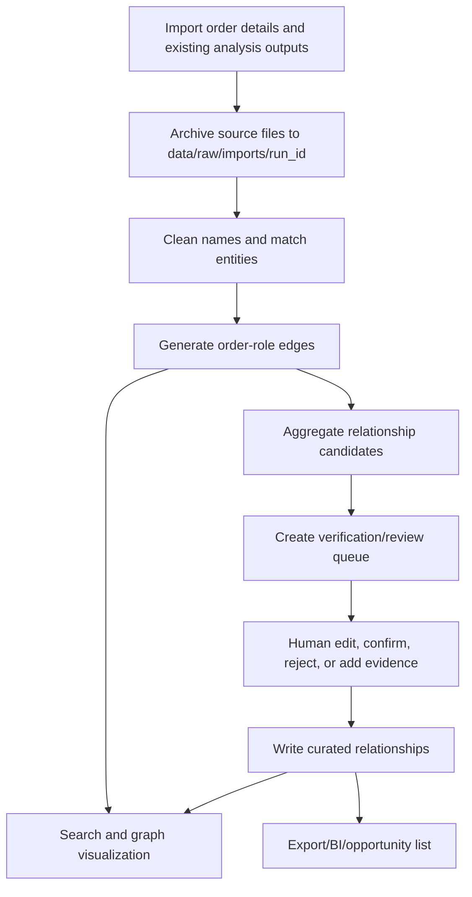

# Trade Entity Graph

English | [中文](README.md)

`trade-entity-graph` is an entity relationship asset system for direct-customer overseas trade and first-leg ocean freight order analysis. It turns one-off Excel analysis outputs into a reusable system for importing, reviewing, tracing, visualizing, and exporting company relationship networks.

## Product Summary

Build a reusable, auditable, evidence-backed, human-reviewable, and graph-visualized company relationship system. The system manages company cross-relationships discovered from orders and supports searching any entity, expanding its network, reviewing evidence, and analyzing relationship opportunities.

## Core Principles

- Order-role relationships are not final business relationships: an order co-occurrence such as `customer -> notify party` is evidence, not proof of a same-group, subsidiary, or trading-partner relationship.
- Final relationships must be explainable: every curated relationship should trace back to order evidence, manual decisions, public sources, or sales feedback.
- Human decisions never overwrite raw evidence: confirming, rejecting, editing, or creating relationships appends decision records while preserving original evidence.
- A-B and B-C do not imply A-C: cross-relationships must be displayed, reviewed, and curated independently.
- The MVP prioritizes the full loop: import data, reuse entities, generate edges, review relationships, show an ego graph, and export results before introducing heavy graph databases.

## MVP Scope

- Import existing order analysis outputs and company-name cleaning results;
- Build an entity master table and alias table;
- Preserve order-role relationships such as “Company A is customer, Company B is notify party”;
- Build a relationship candidate table;
- Provide review actions to confirm, reject, edit, and manually create relationships;
- Write confirmed decisions into the curated relationship table;
- Support entity search and one-hop ego graph visualization;
- Show order evidence and manual decisions when a relationship is selected;
- Export relationship details for a center entity.

## Technology Choices

| Area | MVP Choice | Notes |
| --- | --- | --- |
| Data processing | Python + Pandas/Polars | Read Excel/CSV and generate entities, evidence, edges, and candidates |
| Storage | SQLite first, PostgreSQL optional | SQLite for local MVP; PostgreSQL when multi-user collaboration is needed |
| Graph query | Relational edge tables + NetworkX | No Neo4j for MVP; query local subgraphs first |
| Backend API | FastAPI | Search, graph, relationship details, review writes, and exports |
| Frontend | Streamlit first, React optional | Validate workflows quickly before building a production frontend |
| Export | Excel/CSV | Export relationship details, nodes, edges, and review results |

## Repository Layout

```text
trade-entity-graph/
  README.md
  README.en.md
  pyproject.toml
  .env.example
  data/
    raw/
    processed/
    exports/
  docs/
    task-breakdown.md
    technical-plan.md
  src/trade_entity_graph/
    config.py
    db/
    importers/
    services/
    api/
    ui/
    utils/
  scripts/
  tests/
```

## Quick Start

The repository has completed the M0/M1 baseline and now includes the M2-M8 P0 demo loop: Excel/CSV import, source-file archiving, order-role edge generation, relationship candidate aggregation, one-hop graph query, FastAPI endpoints, Chinese Streamlit workbench, export support, and demo acceptance data.

All Python environments, dependency installation, and Python commands in this project should use `uv` to avoid polluting the global Python environment.

```powershell
uv python pin 3.12
uv sync --extra dev
uv run python scripts\init_db.py
uv run python scripts\run_api.py
```

Start the Streamlit prototype:

```powershell
uv run python scripts\run_ui.py
```

### M8 Demo Data and Acceptance

Generate and import demo data with about 50 entities, 80+ orders, and broad relationship coverage:

```powershell
uv --cache-dir .uv-cache run python scripts\generate_demo_data.py
uv --cache-dir .uv-cache run python scripts\init_db.py
uv --cache-dir .uv-cache run python scripts\import_demo_data.py
uv --cache-dir .uv-cache run python scripts\seed_demo_reviews.py
```

The demo files live under `data/demo/`. After import, the system keeps pending candidates for manual review and pre-seeds reviewed relationships covering `same_group`, `subsidiary`, `factory_node`, `sales_center`, `trading_partner`, `logistics_service`, and `rejected_relation`.

Run smoke tests:

```powershell
uv run pytest
```

During import, the system copies original Excel/CSV files to `data/raw/imports/<run_id>/` and records each file role, original path, archived path, file size, and SHA256 in the SQLite `import_source_file` table.

## Data Flow



## Core Data Objects

- `entity`: Entity master data; all relationships and evidence bind to `entity_id`.
- `entity_alias`: Original names, cleaned names, short names, historical names, and manually added aliases.
- `order_evidence`: Order evidence with order number, TEU, destination, product, source file, sheet, row, and `run_id`.
- `order_role_edge`: Evidence edges between customers, shippers, consignees, and notify parties.
- `relationship_claim`: System-generated relationship candidates.
- `curated_relationship`: Final confirmed, rejected, pending, or manually created relationships.
- `relationship_decision`: Human review actions with before/after state, reason, operator, and timestamp.
- `import_batch`: Import metadata, including source files, mapping version, rule version, success count, and error count.
- `import_source_file`: Per-source archive metadata, including file role, original path, archived path, file size, and SHA256.
- `audit_log`: Audit trail for key operations.

## Key Documents

- `企业关系图谱系统_PRD.md`: Product requirements document.
- `MVP研发任务拆解.md`: Original MVP task breakdown.
- `docs/task-breakdown.md`: Organized development task list.
- `docs/technical-plan.md`: MVP technical plan, data model, APIs, and UI breakdown.
- `docs/superpowers/plans/2026-05-22-import-source-file-archive.md`: Source-file archive implementation plan and execution record.

## Current Development Status

As of 2026-05-25, the current branch includes the M2-M8 P0 loop, source-file archiving, and demo acceptance data. Latest verification:

```powershell
uv --cache-dir .uv-cache run pytest
uv --cache-dir .uv-cache run ruff check .
```

Result: `14 passed`, ruff `All checks passed!`. A `.pytest_cache` write-permission warning may appear in the current desktop sandbox and does not affect the test result.

## Recommended Development Order

1. M0: Project scaffold and baseline conventions.
2. M1: Database schema and initialization script.
3. M2: Excel/CSV import and field mapping.
4. M3: Order-role edge generation and aggregate statistics.
5. M4: Relationship candidate generation, scoring, and recommendation reasons.
6. M5: NetworkX local graph query service.
7. M6: FastAPI endpoints for search, graph, details, reviews, and exports.
8. M7: Streamlit MVP pages.
9. M8: Review persistence, audit logs, acceptance demo.

## Remote Repository

```text
git@github.com:Fonna/trade-entity-graph.git
```
