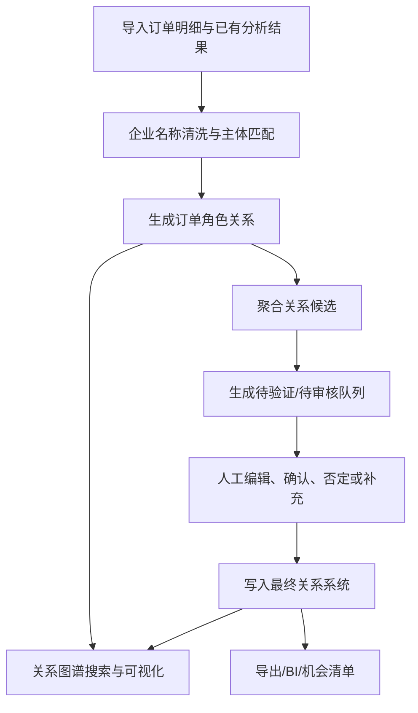

# Trade Entity Graph / 企业关系图谱系统

[English](README.en.md) | 中文

`trade-entity-graph` 是一个面向直客出海与海运头程订单分析的企业关系资产管理系统。项目目标是把一次性 Excel 分析结果沉淀为可导入、可审核、可追溯、可图谱展示和可导出的企业关系系统。

## 一句话定位

建设一套可沉淀、可复用、可人工确认、可追溯证据、可图谱可视化的企业关系系统，用于管理订单中发现的企业交叉关系，并支持围绕任一企业主体搜索、展开、审核和分析其关系网络。

## 核心原则

- 订单角色关系不是最终企业关系：订单中“下单客户 -> 通知人”等共现关系是证据边，不等同于同集团、子公司或贸易伙伴结论。
- 最终关系必须可解释：每条最终关系都应能追溯到订单证据、人工判断、公开信息或销售反馈。
- 人工判断不覆盖证据：确认、否定、修改和新增关系都写入决策记录，原始订单证据长期保留。
- A-B、B-C 不自动推出 A-C：交叉关系必须分别展示、分别审核、分别沉淀。
- MVP 先跑通闭环：优先保证数据导入、主体复用、边生成、关系审核、图谱展示和导出闭环，不提前引入重型图数据库。

## MVP 范围

- 导入当前项目已有订单分析结果和企业清洗结果；
- 建立企业主体库和企业别名库；
- 保留订单角色关系，例如“企业 A 是下单客户，企业 B 是通知人”；
- 建立关系候选库；
- 提供人工审核、确认、否定、修改和人工新增关系入口；
- 将人工确认结果写入最终关系库；
- 支持企业搜索和中心企业一跳关系图谱展示；
- 支持点击关系查看订单证据和人工判断；
- 支持导出中心企业关系明细。

## 技术选型

| 模块 | MVP 选择 | 说明 |
| --- | --- | --- |
| 数据处理 | Python + Pandas/Polars | 读取 Excel/CSV，生成主体、证据、边和候选关系 |
| 关系存储 | SQLite 优先，PostgreSQL 可选 | 本地 MVP 使用 SQLite；多人协作后迁移 PostgreSQL |
| 图查询 | 关系型边表 + NetworkX | 不单独部署 Neo4j，先做局部子图查询 |
| 后端 API | FastAPI | 提供搜索、图谱、关系详情、审核写入和导出接口 |
| 前端页面 | Streamlit 优先，React 可选 | MVP 先快速验证流程，需求稳定后再产品化前端 |
| 导出 | Excel/CSV | 导出关系明细、节点、边和审核结果 |

## 仓库结构

```text
trade-entity-graph/
  README.md
  README.en.md
  pyproject.toml
  .env.example
  data/
    raw/
    processed/
    exports/
  docs/
    task-breakdown.md
    technical-plan.md
  src/trade_entity_graph/
    config.py
    db/
    importers/
    services/
    api/
    ui/
    utils/
  scripts/
  tests/
```

## 快速开始

当前仓库处于 M0 项目脚手架阶段。核心数据导入、关系生成、审核写回和图谱页面将在后续迭代实现。

```powershell
python -m venv .venv
.\.venv\Scripts\Activate.ps1
pip install -e ".[dev]"
python scripts\init_db.py
python scripts\run_api.py
```

启动 Streamlit 原型：

```powershell
python scripts\run_ui.py
```

运行基础测试：

```powershell
pytest
```

## 数据流



## 核心数据对象

- `entity`：企业主体，所有关系和证据绑定到统一 `entity_id`。
- `entity_alias`：企业别名，保存原始名、清洗名、简称、历史名和人工补充名称。
- `order_evidence`：订单证据，保存订单号、TEU、目的国、产品、源文件、sheet、行号和 `run_id`。
- `order_role_edge`：订单角色边，保存下单客户、发货人、收货人、通知人之间的证据关系。
- `relationship_claim`：系统生成的关系候选。
- `curated_relationship`：人工确认、否定、待验证或人工新增的最终关系。
- `relationship_decision`：人工审核记录，保存动作前后状态、理由、操作人和时间。
- `import_batch`：导入批次，保存源文件、字段映射版本、规则版本、成功/异常行数。
- `audit_log`：关键操作审计日志。

## 关键文档

- `企业关系图谱系统_PRD.md`：产品需求文档。
- `MVP研发任务拆解.md`：MVP 研发任务原始拆解。
- `docs/task-breakdown.md`：整理后的研发任务清单。
- `docs/technical-plan.md`：MVP 技术方案、数据模型、API 和前端页面拆解。

## 推荐开发顺序

1. M0：项目脚手架与基础规范。
2. M1：数据库 schema 与初始化脚本。
3. M2：Excel/CSV 导入与字段映射。
4. M3：订单角色边生成和聚合统计。
5. M4：关系候选生成、评分和推荐理由。
6. M5：NetworkX 局部图查询服务。
7. M6：FastAPI 搜索、图谱、详情、审核和导出接口。
8. M7：Streamlit MVP 页面。
9. M8：人工审核写回、审计和验收演示。

## 远程仓库

```text
git@github.com:Fonna/trade-entity-graph.git
```
