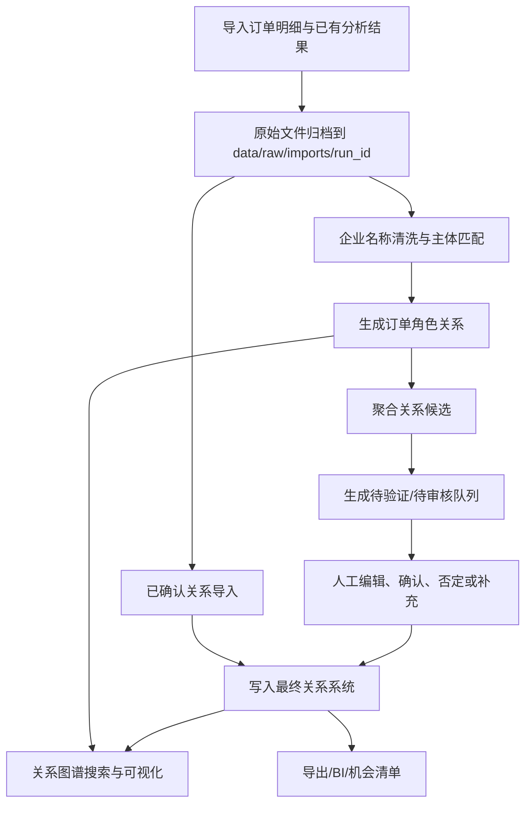

# Trade Entity Graph / 企业关系图谱系统
## 2026-06-03 Status Update

- Added structured supplemental evidence: `relationship_external_evidence` can link to relationship candidates or curated relationships.
- FastAPI provides `POST /relationships/{relationship_id}/external-evidence`; review and manual relationship requests can include `external_evidence`.
- Streamlit relationship details separate order evidence and supplemental evidence, and review forms accept optional supplemental evidence.
- P1 auxiliary order-role edges are implemented: the importer now generates `shipper_to_notify` and `consignee_to_notify` in addition to the four P0 role edges.
- Latest verification: `uv --cache-dir .uv-cache run pytest` returned `208 passed`, and `uv --cache-dir .uv-cache run ruff check .` returned `All checks passed!`.

[English](README.en.md) | 中文

`trade-entity-graph` 是一个面向直客出海与海运头程订单分析的企业关系资产管理系统。项目目标是把一次性 Excel 分析结果沉淀为可导入、可审核、可追溯、可图谱展示和可导出的企业关系系统。

## 一句话定位

建设一套可沉淀、可复用、可人工确认、可追溯证据、可图谱可视化的企业关系系统，用于管理订单中发现的企业交叉关系，并支持围绕任一企业主体搜索、展开、审核和分析其关系网络。

## 核心原则

- 订单角色关系不是最终企业关系：订单中“下单客户 -> 通知人”等共现关系是证据边，不等同于同集团、子公司或贸易伙伴结论。
- 最终关系必须可解释：每条最终关系都应能追溯到订单证据、人工判断、公开信息或销售反馈。
- 人工判断不覆盖证据：确认、否定、修改和新增关系都写入决策记录，原始订单证据长期保留。
- A-B、B-C 不自动推出 A-C：交叉关系必须分别展示、分别审核、分别沉淀。
- MVP 先跑通闭环：优先保证数据导入、主体复用、边生成、关系审核、图谱展示和导出闭环，不提前引入重型图数据库。

## MVP 范围

- 导入当前项目已有订单分析结果和企业清洗结果；
- 建立企业主体库和企业别名库；
- 保留订单角色关系，例如“企业 A 是下单客户，企业 B 是通知人”；
- 建立关系候选库；
- 提供人工审核、确认、否定、修改和人工新增关系入口；
- 将人工确认结果写入最终关系库；
- 支持企业搜索、中心企业一跳/二跳关系图谱展示和两企业路径查询；
- 支持点击关系查看订单证据和人工判断；
- 支持导出中心企业关系明细。

## 技术选型

| 模块 | MVP 选择 | 说明 |
| --- | --- | --- |
| 数据处理 | Python + Pandas/Polars | 读取 Excel/CSV，生成主体、证据、边和候选关系 |
| 关系存储 | SQLite 优先，PostgreSQL 可选 | 本地 MVP 使用 SQLite；多人协作后迁移 PostgreSQL |
| 图查询 | 关系型边表 + NetworkX | 不单独部署 Neo4j，先做局部子图查询 |
| 后端 API | FastAPI | 提供搜索、图谱、关系详情、审核写入和导出接口 |
| 前端页面 | Streamlit 优先，React 可选 | MVP 先快速验证流程，需求稳定后再产品化前端 |
| 导出 | Excel/CSV | 导出关系明细、节点、边和审核结果 |

## 仓库结构

```text
trade-entity-graph/
  README.md
  README.en.md
  pyproject.toml
  .env.example
  data/
    raw/
    processed/
    exports/
  docs/
    task-breakdown.md
    technical-plan.md
  src/trade_entity_graph/
    config.py
    db/
    importers/
    services/
    api/
    ui/
    utils/
  scripts/
  tests/
```

## 快速开始

当前仓库已完成 M0/M1 基线，并具备 M2-M10 P0/P1 可演示闭环：Excel/CSV 导入、原始文件归档、订单角色边生成、候选关系聚合、一跳/二跳图谱查询、两企业路径查询、FastAPI 接口、中文 Streamlit 工作台、导出能力、演示验收数据包，以及 M9 真实数据试运行与导入质量闭环，包括字段映射配置、行级导入异常记录、导入批次查询、质量报告和异常 CSV 导出。M10 新增深度受限的二跳展开、`GET /paths` 和图谱页路径查询。

本项目所有 Python 环境、依赖安装和命令运行统一使用 `uv`，避免污染全局 Python 环境。

```powershell
uv python pin 3.12
uv sync --extra dev
uv run python scripts\init_db.py
uv run python scripts\run_api.py
```

启动 Streamlit 原型：

```powershell
uv run python scripts\run_ui.py
```

### M8 演示数据与验收

生成并导入约 50 个主体、80+ 条订单和覆盖多种关系类型的演示数据：

```powershell
uv --cache-dir .uv-cache run python scripts\generate_demo_data.py
uv --cache-dir .uv-cache run python scripts\init_db.py
uv --cache-dir .uv-cache run python scripts\import_demo_data.py
uv --cache-dir .uv-cache run python scripts\seed_demo_reviews.py
```

演示数据位于 `data/demo/`。导入后，系统会保留一批待审核候选关系，并预置覆盖 `same_group`、`subsidiary`、`factory_node`、`sales_center`、`trading_partner`、`logistics_service` 和 `rejected_relation` 的已审核关系。

运行基础测试：

```powershell
uv run pytest
```

导入时，系统会复制原始 Excel/CSV 文件到 `data/raw/imports/<run_id>/`，并在 SQLite 表 `import_source_file` 中记录文件角色、原始路径、归档路径、文件大小和 SHA256。

### M9 真实数据试运行与导入质量闭环

M9 面向真实 Excel/CSV 试运行：默认字段映射可识别常见中文/英文别名，支持通过配置适配不同来源文件。导入过程会保留有效行，并将字段缺失、必填值为空、TEU 格式错误、未知企业引用、无效关系配对等问题写入 `import_error`，便于追溯和复核。

关系导入分为两个入口：`已有关系候选文件路径` 写入 `relationship_claim`，后续进入人工审核；`已确认关系文件路径` 直接写入 `curated_relationship`，并同步写入 `relationship_decision` 和 `audit_log`。已确认关系文件至少需要能解析出 `from_entity_id/from_entity_name`、`to_entity_id/to_entity_name` 和 `relation_type`；`relation_status` 默认 `verified`，`source_type` 默认 `imported_confirmed`，`verified_by` 使用导入人。

导入批次和质量结果可通过 API 查询：`GET /imports`、`GET /imports/{run_id}`、`GET /imports/{run_id}/errors`、`GET /imports/{run_id}/quality-report`。Streamlit 数据导入页展示最近批次、质量摘要、异常明细，并支持导出异常 CSV。

### M10 二跳图谱与两企业路径查询

M10 将图谱服务扩展为受控的局部探索：`GET /entities/{entity_id}/ego-graph?depth=2&max_nodes=50` 可在默认一跳兼容的基础上展开二跳，并通过 `max_nodes` 限制节点数量；默认仍隐藏 `rejected` 关系，可用 `include_rejected=true` 显示。

两企业路径查询通过 `GET /paths?from_entity_id=<A>&to_entity_id=<C>&max_depth=3&max_paths=5` 返回可解释路径、路径节点、边来源、状态和分数。Streamlit 关系图谱页支持设置 `Graph depth` / `Max nodes`，并在“两企业路径查询”区域输入起点、终点、最大深度和路径数，表格展示 `step/from_name/to_name/relation_type/record_type/status/evidence`；未知主体或无路径会给出可见提示。

## 数据流



## 核心数据对象

- `entity`：企业主体，所有关系和证据绑定到统一 `entity_id`。
- `entity_alias`：企业别名，保存原始名、清洗名、简称、历史名和人工补充名称。
- `order_evidence`：订单证据，保存订单号、TEU、目的国、产品、源文件、sheet、行号和 `run_id`。
- `order_role_edge`：订单角色边，保存下单客户、发货人、收货人、通知人之间的证据关系。
- `relationship_claim`：系统生成或候选文件导入的关系候选。
- `curated_relationship`：人工确认、已确认文件导入、否定、待验证或人工新增的最终关系。
- `relationship_decision`：人工审核或已确认关系导入记录，保存动作前后状态、理由、操作人和时间。
- `import_batch`：导入批次，保存源文件、字段映射版本、规则版本、成功/异常行数。
- `import_source_file`：导入源文件归档记录，保存文件角色、原始路径、归档路径、文件大小和 SHA256。
- `audit_log`：关键操作审计日志。

## 关键文档

- `企业关系图谱系统_PRD.md`：产品需求文档。
- `MVP研发任务拆解.md`：MVP 研发任务原始拆解。
- `docs/task-breakdown.md`：整理后的研发任务清单。
- `docs/technical-plan.md`：MVP 技术方案、数据模型、API 和前端页面拆解。
- `docs/superpowers/plans/2026-05-22-import-source-file-archive.md`：原始文件归档实现计划与执行记录。

## 当前开发状态

截至 2026-06-01，当前分支已包含 M2-M10 P0/P1 闭环、原始文件归档能力、历史关系复用、全局待审核队列、中文 Streamlit 工作台、演示验收数据包、M9 真实数据试运行与导入质量闭环，以及 M10 二跳图谱和两企业路径查询能力。最近一次验证：

```powershell
uv --cache-dir .uv-cache run pytest
uv --cache-dir .uv-cache run ruff check .
```

验证结果：`190 passed`，ruff `All checks passed!`。

## 推荐开发顺序

1. M0：项目脚手架与基础规范。
2. M1：数据库 schema 与初始化脚本。
3. M2：Excel/CSV 导入与字段映射。
4. M3：订单角色边生成和聚合统计。
5. M4：关系候选生成、评分和推荐理由。
6. M5：NetworkX 局部图查询服务。
7. M6：FastAPI 搜索、图谱、详情、审核、全局待审核队列和导出接口。
8. M7：Streamlit MVP 页面与待审核队列工作台。
9. M8：人工审核写回、审计和验收演示。
10. M9：真实数据试运行、导入质量报告和异常闭环。
11. M10：二跳图谱展开、`GET /paths` 两企业路径查询和 Streamlit 路径查询工作流。

## 远程仓库

```text
git@github.com:Fonna/trade-entity-graph.git
```
