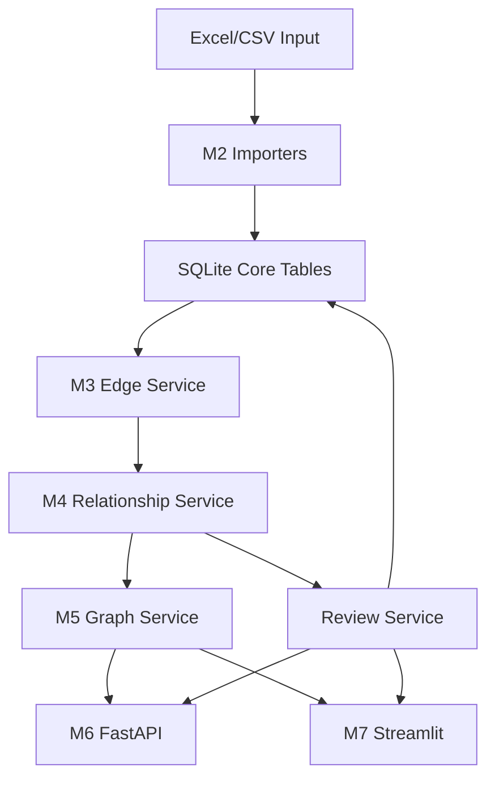

# M2-M7 P0 Development Design

## Goal

Build the P0 demo loop from M2 through M7 for `trade-entity-graph`: import order and entity data, generate order-role evidence edges, aggregate relationship candidates, query one-hop graphs, expose FastAPI endpoints, and provide a Streamlit MVP workbench.

## Scope

This design covers only the P0 flow listed in `docs/task-breakdown.md`:

- M2: Excel/CSV import and field mapping.
- M3: P0 order-role edge generation.
- M4: relationship candidate aggregation and explainable scoring.
- M5: one-hop graph query service.
- M6: FastAPI P0 endpoints.
- M7: Streamlit MVP page for import, search, graph, review, and export.

This design does not include P1 or productization work:

- Two-hop graph expansion.
- A-to-C path search.
- Complex exception export workflows.
- Authentication, permissions, or multi-user workflow.
- React UI.
- Dedicated graph database.
- External search engine.

## Architecture

Use a service-layer-first modular monolith. Business logic lives in importers and services. FastAPI and Streamlit are thin adapters over those services.



## Module Boundaries

- `src/trade_entity_graph/importers/`
  - Reads Excel/CSV files.
  - Resolves source column aliases to logical fields.
  - Creates import batches, entities, aliases, order evidence, and optional imported claims.

- `src/trade_entity_graph/services/entity_service.py`
  - Searches entities by canonical name or alias.
  - Returns entity details, aliases, and simple relationship/order statistics.

- `src/trade_entity_graph/services/relationship_service.py`
  - Generates P0 order-role edges from imported order rows.
  - Aggregates order-role edges into relationship candidates.
  - Returns relationship details and relationship evidence.

- `src/trade_entity_graph/services/review_service.py`
  - Confirms, rejects, modifies, or manually creates curated relationships.
  - Writes `relationship_decision` and `audit_log` records.
  - Does not physically delete rejected relationships.

- `src/trade_entity_graph/services/graph_service.py`
  - Builds one-hop graph JSON from `order_role_edge` and `curated_relationship`.
  - Defaults to hiding rejected curated relationships.

- `src/trade_entity_graph/services/export_service.py`
  - Exports center-entity relationship details to CSV or Excel.

- `src/trade_entity_graph/api/routers/`
  - Defines FastAPI endpoints.
  - Performs request/response adaptation only.
  - Does not contain business logic.

- `src/trade_entity_graph/ui/streamlit_app.py`
  - Provides a demo workbench with tabs.
  - Calls services directly instead of making HTTP calls to the local FastAPI app.

## M2 Import Design

M2 imports preserve the source context needed for auditability:

- `source_file`
- `source_sheet`
- `source_row`
- `run_id`

Supported inputs:

- Entity cleaning files produce `entity` and `entity_alias`.
- Order detail files produce `order_evidence`.
- Existing relationship candidate files produce `relationship_claim`.

Each import run creates one `import_batch` row. The run records source file metadata, operator, rule version, field mapping version, success row count, error row count, and summary text.

Post-implementation update: imports also create one `import_source_file` row per input file. Source files are copied to `data/raw/imports/<run_id>/`, and each record stores the source role, original path, archived path, file name, file size, and SHA256 hash.

Field mapping is explicit and small. Known source columns are mapped to logical fields such as:

- `canonical_name`
- `original_name`
- `clean_name`
- `order_id`
- `customer_name`
- `shipper_name`
- `consignee_name`
- `notify_name`
- `teu`
- `destination_country`
- `product_name`

## M3 Order-Role Edge Design

The P0 edge generation creates these edge types:

- `customer_to_shipper`
- `customer_to_consignee`
- `customer_to_notify`
- `shipper_to_consignee`

An order-role edge means two entities appeared in one order with a specific role pairing. It is evidence, not a final business relationship conclusion.

Invalid role names are filtered before edge creation:

- Empty values.
- `SAME AS`.
- `TO ORDER`.
- `YQN` self-company placeholders.

Each edge copies order context into `order_role_edge`, including order ID, TEU, product, destination, source file, sheet, row, and run ID. This keeps relationship detail and export queries simple.

## M4 Relationship Candidate Design

Relationship candidates are aggregated from `order_role_edge` by entity pair.

Each aggregate writes one `relationship_claim` row with:

- `from_entity_id`
- `to_entity_id`
- `candidate_relation_type`
- `relation_status`
- `confidence_level`
- `confidence_score`
- `order_count`
- `total_teu`
- `role_pair_summary`
- `destination_summary`
- `product_summary`
- `recommendation_reason`

Default `candidate_relation_type` is `trading_partner_candidate`.

Scoring is simple and explainable:

- High confidence when `order_count >= 5` or `total_teu >= 20`.
- Medium confidence when `order_count >= 2` or `total_teu >= 5`.
- Low confidence otherwise.

The recommendation reason names the strongest signals, such as order count, TEU, role pair mix, destination countries, and products.

Existing rejected curated relationships are not overwritten by candidate aggregation. Candidates can still be recorded, but graph and UI defaults hide rejected final relationships.

## M5 Graph Query Design

The graph service returns one-hop graph JSON for a center entity:

```json
{
  "center_entity_id": "ENT_000001",
  "nodes": [],
  "edges": []
}
```

Node fields:

- `id`
- `label`
- `entity_type`
- `tags`

Edge fields:

- `id`
- `source`
- `target`
- `edge_type`
- `relation_type`
- `status`
- `order_count`
- `teu`

The graph service reads:

- `order_role_edge` for evidence edges.
- `curated_relationship` for final relationships.

By default, `relation_status = rejected` is hidden.

## M6 FastAPI Design

FastAPI exposes P0 endpoints:

- `GET /health`
- `GET /entities/search?q=...`
- `GET /entities/{entity_id}`
- `GET /entities/{entity_id}/neighbors`
- `GET /entities/{entity_id}/ego-graph`
- `GET /relationships/{relationship_id}`
- `GET /relationships/{relationship_id}/evidence`
- `POST /relationships/{relationship_id}/decision`
- `POST /relationships/manual`
- `POST /exports/relationships`
- `POST /imports/run`

The API layer calls services and returns JSON. API tests verify request and response contracts even though Streamlit does not call the API over HTTP.

## M7 Streamlit Design

The Streamlit MVP is a single workbench with tabs:

- Import: enter local file paths and trigger import.
- Search: search entities and show matches.
- Graph: select a center entity and show one-hop graph tables plus summary metrics.
- Relationship Detail: inspect one relationship and its evidence.
- Review: confirm, reject, modify, or manually add relationships.
- Export: export relationship details for a center entity.

Streamlit directly calls service functions. This is intentional for the local MVP because it avoids running a second local HTTP process and keeps the demo simple. FastAPI remains covered by separate API tests.

Post-implementation update: the Streamlit workbench is localized in Chinese, includes a top-level "基础逻辑与使用方法" guide, and shows archived source-file details after a successful import.

## Testing Strategy

Use TDD for all behavior changes. Test layers:

- Importer unit tests for field mapping, workbook reading, batches, entities, evidence, and claims.
- Service tests for role-edge generation, candidate aggregation, entity search, review decisions, graph query, and export.
- API tests using FastAPI `TestClient`.
- Streamlit smoke test that imports the module and verifies the app entry point is callable.

Required verification before completion:

```powershell
uv --cache-dir .uv-cache run pytest
uv --cache-dir .uv-cache run ruff check .
```

Latest post-implementation verification on 2026-05-22: `uv --cache-dir .uv-cache run pytest` reported 14 passed, and `uv --cache-dir .uv-cache run ruff check .` reported no errors.

## Development Order

1. M2 import foundation.
2. M3 order-role edge generation.
3. M4 relationship candidate aggregation.
4. M5 service-layer search, detail, graph, and export.
5. M6 FastAPI routers and API tests.
6. M7 Streamlit MVP workbench.

## Acceptance Criteria

The P0 loop is complete when tests can demonstrate:

- Import sample entity and order files.
- Create `import_batch`, `entity`, `entity_alias`, and `order_evidence`.
- Generate the four P0 order-role edge types.
- Aggregate relationship candidates with counts, TEU, confidence, and recommendation reasons.
- Search entities.
- Retrieve entity details.
- Retrieve one-hop graph JSON.
- Retrieve relationship details and evidence.
- Confirm, reject, modify, and manually add curated relationships.
- Export center-entity relationship details.
- Load the Streamlit MVP module.

## Self-Review

- Placeholder scan: no unfilled placeholder markers remain.
- Internal consistency: importers feed SQLite tables, services read/write those tables, API and UI are thin adapters.
- Scope check: this is a single P0 MVP loop and excludes P1 features.
- Ambiguity check: Streamlit uses service-layer calls directly; FastAPI is still tested separately.
