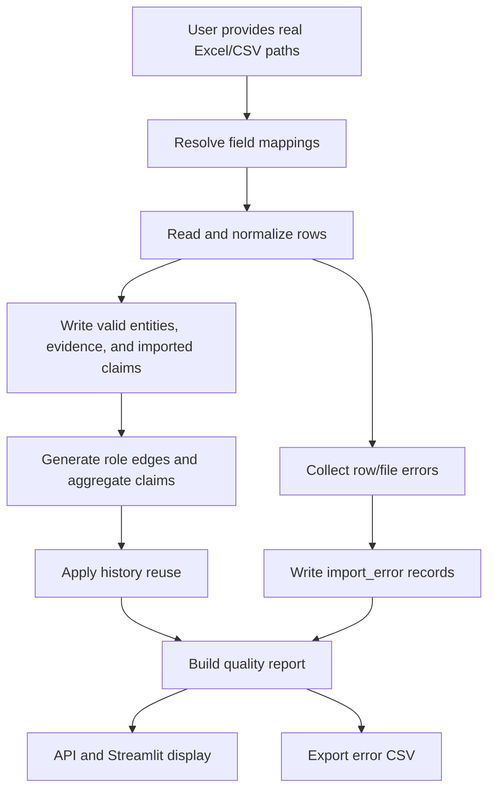

# M9 Real Data Import QA Design

## Purpose

M9 moves `trade-entity-graph` from a repeatable demo loop to a real-data trial loop. The
system already supports M2-M8 P0 flows: import, source-file archive, order-role edge
generation, relationship candidate aggregation, history reuse, review, graph display, and
export. The next risk is not whether the happy path works; it is whether real customer
Excel/CSV files can be imported safely when field names drift, rows are incomplete, names are
dirty, and numeric values are inconsistent.

M9 adds an import quality loop:

1. Accept real files whose column names vary across workbooks.
2. Preserve import problems instead of silently dropping bad rows.
3. Let users review each import batch, archived source file, quality summary, and row-level
   import errors.
4. Export import errors so business users can fix source files or prepare manual review input.

## Goals

- Add configurable field mapping so common real-world column variants can map to the normalized
  importer fields without code changes.
- Record row-level import errors and warnings with `run_id`, source file, sheet, row number,
  field name, raw value, severity, and human-readable message.
- Keep partial imports usable: a bad row should not fail the whole run unless a required file or
  required field mapping is missing.
- Add import batch query services and API endpoints for batch history, batch detail, error list,
  and quality summaries.
- Enhance the Streamlit data import workflow with recent batch history, quality metrics, error
  tables, and CSV export for import errors.
- Keep all M2-M8 behavior compatible unless an explicit M9 validation rule identifies a row as
  invalid.

## Non-Goals

- No React migration.
- No PostgreSQL migration.
- No permission system or multi-user workflow.
- No two-hop graph expansion or path search.
- No public web verification or automated company relationship research.
- No online row repair UI in M9. Users can export errors, fix the source data, and re-import.
- No destructive cleanup of previous import runs.

## Current Context

The current implementation has:

- `import_batch` for import run metadata.
- `import_source_file` for archived source files and SHA256 metadata.
- `entity`, `entity_alias`, `order_evidence`, `order_role_edge`, `relationship_claim`,
  `curated_relationship`, `relationship_decision`, and `audit_log`.
- `run_import` orchestration for entity, order, and optional existing relationship files.
- Services for edge generation, claim aggregation, history reuse, review queue, graph, review,
  and export.
- FastAPI endpoints for P0 import, entity, graph, relationship, review queue, and relationship
  export flows.
- A Chinese Streamlit MVP workbench with tabs for import, search, graph, detail, queue, review,
  and export.

M9 should extend these boundaries rather than replace them.

## Data Model

### `import_error`

Add a new table:

```sql
CREATE TABLE IF NOT EXISTS import_error (
  error_id TEXT PRIMARY KEY,
  run_id TEXT NOT NULL REFERENCES import_batch(run_id),
  source_file_id TEXT REFERENCES import_source_file(source_file_id),
  file_role TEXT,
  source_path TEXT,
  sheet_name TEXT,
  row_number INTEGER,
  column_name TEXT,
  normalized_field TEXT,
  raw_value TEXT,
  error_type TEXT NOT NULL,
  severity TEXT NOT NULL,
  message TEXT NOT NULL,
  created_at TEXT NOT NULL
);
```

Recommended indexes:

- `idx_import_error_run` on `run_id`
- `idx_import_error_type` on `error_type`
- `idx_import_error_severity` on `severity`

Severity values:

- `blocking`: this row or file cannot produce the intended normalized record.
- `warning`: the row can still be imported, but the imported result has a quality risk.

Initial `error_type` values:

- `missing_required_field`
- `missing_required_value`
- `unknown_entity_reference`
- `invalid_numeric_value`
- `invalid_relationship_pair`
- `invalid_status_or_type`
- `duplicate_source_record`
- `file_read_error`
- `field_mapping_error`

M9 should keep this enum practical, not exhaustive. New values can be added later as long as the
UI treats unknown types as displayable strings.

### `import_batch` Summary Fields

Avoid a risky migration that tries to store every quality metric as columns. M9 can compute most
summary values from existing tables plus `import_error`.

If a small schema extension is useful, add only stable counters:

- `success_row_count`
- `error_row_count`
- `warning_row_count`

If adding these counters complicates compatibility, skip them and compute counts dynamically in
the import quality service.

## Field Mapping Design

M9 should introduce a small field mapping layer before importer row normalization.

### Mapping Source

Use a repository-owned default mapping file, for example:

```text
src/trade_entity_graph/importers/field_mappings/default.json
```

The existing `field_mapping_version` on `import_batch` should identify the mapping version used
for a run. The default version can remain a simple string such as `default-v1`.

The mapping format should be explicit and simple:

```json
{
  "orders": {
    "order_no": ["order_no", "订单号", "业务编号", "提单号"],
    "customer_name": ["customer_name", "下单客户", "客户名称", "Booking Customer"],
    "shipper_name": ["shipper_name", "发货人", "Shipper"],
    "consignee_name": ["consignee_name", "收货人", "Consignee"],
    "notify_name": ["notify_name", "通知人", "Notify Party"],
    "teu": ["teu", "TEU", "箱量"],
    "destination_country": ["destination_country", "目的国", "目的国家"],
    "product": ["product", "品名", "产品"]
  },
  "entities": {
    "canonical_name": ["canonical_name", "标准名", "企业标准名"],
    "raw_name": ["raw_name", "原始名", "原始企业名"],
    "clean_name": ["clean_name", "清洗名", "清洗企业名"]
  },
  "relationships": {
    "from_entity_name": ["from_entity_name", "主体A", "企业A"],
    "to_entity_name": ["to_entity_name", "主体B", "企业B"],
    "relation_type": ["relation_type", "关系类型"],
    "relation_status": ["relation_status", "关系状态"]
  }
}
```

### Matching Rules

- Normalize column names by trimming whitespace and folding full-width spaces.
- Match exact aliases first.
- If two source columns map to the same normalized field, use the first match and record a
  `field_mapping_error` warning for the duplicate mapping.
- If a required normalized field is not found, record a `missing_required_field` blocking error
  for the file role and skip records that require that field.
- Do not infer ambiguous fields with fuzzy matching in M9. Real-world convenience is useful, but
  unexplained fuzzy mapping is risky for import auditability.

## Import Error Capture

The pipeline should collect errors during these stages:

1. File read: unsupported format, missing path, workbook read failure.
2. Header resolution: missing required fields, duplicate mapping, unmapped optional fields if
   useful for diagnostics.
3. Row normalization: missing required values, invalid numeric values, invalid status/type values.
4. Entity matching: names that cannot resolve to an imported entity or alias.
5. Relationship candidate import: invalid self-pairs, missing endpoints, unknown relation types.

The importer should return both successful rows and collected error records. At the end of a run,
the pipeline writes errors to `import_error` in the same database used for imported records.

Blocking errors should not necessarily roll back the whole run. The run fails only when:

- No provided file can be read.
- A required file role is provided but none of its required fields can be resolved.
- Database initialization or write fails.

Otherwise, imported valid rows remain available, and the quality report explains what was skipped.

## Import Quality Service

Add `src/trade_entity_graph/services/import_quality_service.py` with small query-focused
functions:

- `list_import_batches(limit, offset, db_path=None)`
- `get_import_batch_detail(run_id, db_path=None)`
- `list_import_errors(run_id, severity=None, error_type=None, limit=200, offset=0, db_path=None)`
- `get_import_quality_report(run_id, db_path=None)`
- `export_import_errors(run_id, output_path=None, db_path=None)`

The quality report should include:

- Import batch metadata: `run_id`, started/completed timestamps, status, source path, rule
  version, field mapping version.
- Archived source files: role, original path, archived path, file size, SHA256.
- Imported counts: entities, aliases, order evidence, order role edges, relationship claims.
- Review/historical reuse counts when available: history matched, history conflict, pending
  verify, unchanged.
- Error counts by severity and error type.
- Top affected fields and top affected source files.

## API Design

Extend the imports router:

- `GET /imports`
  - Query params: `limit`, `offset`, optional `status`.
  - Returns import batches with compact counts and quality status.
- `GET /imports/{run_id}`
  - Returns batch metadata, archived files, imported counts, and quality summary.
- `GET /imports/{run_id}/errors`
  - Query params: `severity`, `error_type`, `limit`, `offset`.
  - Returns row-level error records.
- `GET /imports/{run_id}/quality-report`
  - Returns the full report from `get_import_quality_report`.

The existing `POST /imports/run` should include a compact quality summary in its response so the
Streamlit import result can show errors immediately after a run.

## Streamlit Design

Enhance the existing "数据导入" tab instead of adding a separate navigation system.

After a run completes, show:

- Imported counts: entities, order evidence, edges, relationship claims.
- History reuse counts.
- Quality status: no errors, warnings only, or blocking errors present.
- Error summary by type and severity.
- An expandable row-level error table.
- A button to export import errors as CSV.

Below the import form, show "最近导入批次":

- `run_id`
- status
- start/completion time
- source file count
- imported evidence count
- relationship claim count
- blocking error count
- warning count

Selecting a batch should load its detail and error table. Keep the UI simple and table-first; M9
does not need charts.

## Data Flow



## Error Handling

- Use readable Chinese messages in UI-facing error records where practical.
- Keep raw exception details out of the default UI if they are noisy; preserve a concise message
  that tells the user what to fix.
- Never overwrite archived source files from older runs.
- Do not delete imported rows when an import has warnings or row-level blocking errors.
- If the whole run fails before `run_id` creation, return a clear API error and do not write
  partial records.
- If the run fails after `run_id` creation, mark the batch status as failed and preserve any
  captured errors.

## Testing Strategy

Add tests before implementation:

- Schema test: `import_error` table and indexes exist.
- Field mapping test: variant source column names resolve to normalized fields.
- Field mapping warning test: duplicate aliases record a warning.
- Import pipeline test: rows with missing values or invalid TEU produce `import_error` records
  while valid rows import successfully.
- Unknown entity relationship test: supplemental relationship rows referencing unknown companies
  become blocking errors instead of crashing or silently disappearing.
- Import quality service test: batch detail and quality report include archived files, counts, and
  error summaries.
- API tests: `/imports`, `/imports/{run_id}`, `/imports/{run_id}/errors`, and
  `/imports/{run_id}/quality-report`.
- Streamlit unit tests: import tab text and helper formatting cover quality summary and error
  labels.
- Regression tests: existing M2-M8 tests continue to pass unchanged.

Verification commands:

```powershell
uv --cache-dir .uv-cache run pytest
uv --cache-dir .uv-cache run ruff check .
```

## Rollout Plan

Implement M9 in small steps:

1. Add schema and low-level error loader.
2. Add field mapping loader and tests.
3. Capture errors in import normalization and relationship candidate import.
4. Add import quality service and export function.
5. Add API endpoints and update import run response.
6. Enhance Streamlit import tab.
7. Update README and task breakdown with M9 verification notes.

## Acceptance Criteria

M9 is complete when:

- A mixed-quality real-data fixture imports valid rows and records row-level errors for invalid
  rows.
- Import errors include source file, sheet, row number, field, raw value, severity, type, and
  message whenever that context is available.
- `/imports` lists prior runs and compact quality status.
- `/imports/{run_id}/quality-report` returns imported counts, archived files, and error summaries.
- Streamlit shows the latest import's quality summary and can export import errors.
- Existing M2-M8 demo acceptance still passes.
- Full pytest and ruff checks pass.

## Self-Review

- No unresolved markers remain in this design.
- Scope is limited to real-data import quality, batch visibility, and error export.
- M9 intentionally avoids UI productization, database migration, permissions, and graph P1 work.
- The design preserves current P0 behavior while adding diagnostics around dirty real data.
