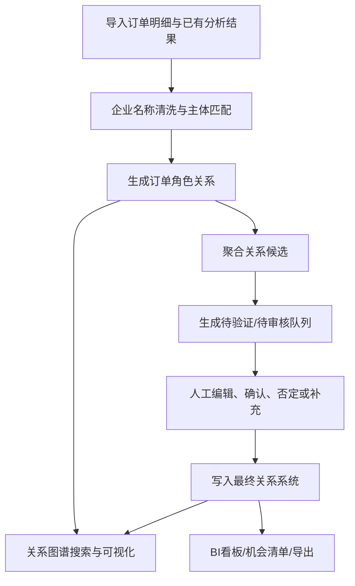
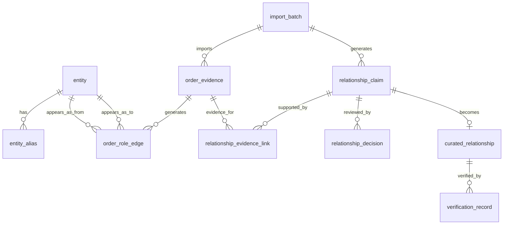
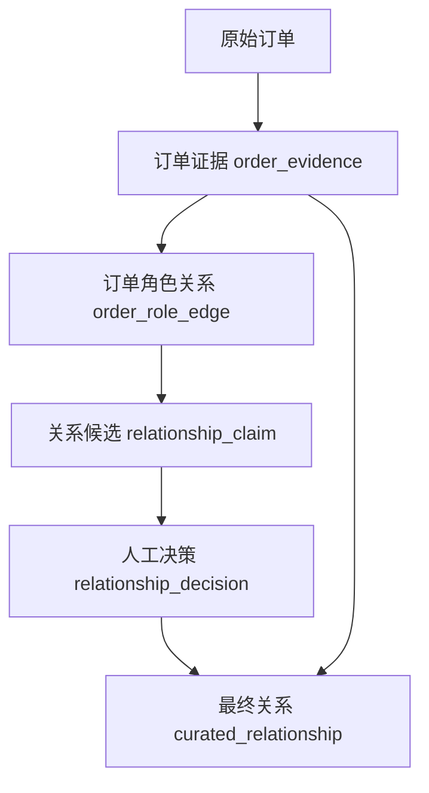
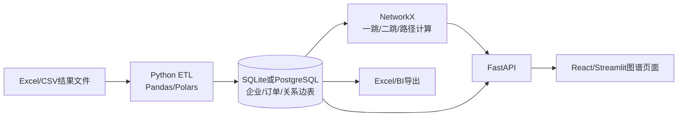
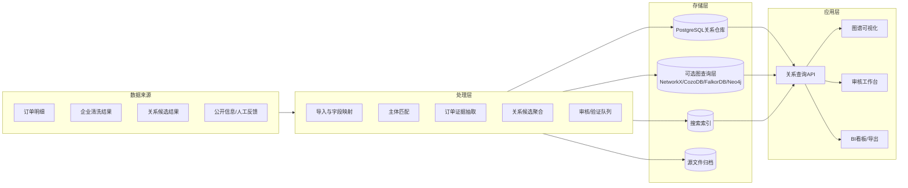

# 企业关系图谱系统 PRD

> 版本：V0.1  
> 日期：2026-05-22  
> 所属项目：直客出海分析 / 海运头程订单关系机会分析  
> 文档定位：用于指导“企业关系图谱系统”的产品设计、研发拆解、数据建模和后续迭代。

---

## 目录

- 1. 一句话定位
- 2. 背景与问题
- 3. 产品目标
  - 3.1 业务目标
  - 3.2 产品目标
  - 3.3 成功指标
- 4. 用户角色
- 5. 核心概念定义
- 6. 产品范围
  - 6.1 MVP 范围
  - 6.2 后续增强范围
  - 6.3 暂不纳入 MVP
- 7. 总体业务流程
- 8. 功能需求
  - 8.1 数据导入与版本管理
    - 8.1.1 功能说明
    - 8.1.2 输入文件
    - 8.1.3 版本要求
  - 8.2 企业主体管理
    - 8.2.1 功能说明
    - 8.2.2 核心能力
    - 8.2.3 主体合并规则
  - 8.3 订单角色关系管理
    - 8.3.1 是否需要保留
    - 8.3.2 必须保留的角色关系
    - 8.3.3 订单角色关系字段
    - 8.3.4 订单角色关系展示要求
  - 8.4 关系候选生成与聚合
    - 8.4.1 功能说明
    - 8.4.2 候选关系类型
    - 8.4.3 聚合逻辑
    - 8.4.4 评分因子
  - 8.5 人工审核与编辑
    - 8.5.1 功能说明
    - 8.5.2 人工动作
    - 8.5.3 审核必填项
    - 8.5.4 审核记录要求
  - 8.6 最终关系系统
    - 8.6.1 功能说明
    - 8.6.2 关系状态
    - 8.6.3 最终关系类型
    - 8.6.4 最终关系字段
    - 8.6.5 冲突处理
  - 8.7 企业搜索与图谱可视化
    - 8.7.1 功能说明
    - 8.7.2 搜索能力
    - 8.7.3 图谱展示
    - 8.7.4 视觉编码
    - 8.7.5 点击交互
  - 8.8 证据详情与追溯
    - 8.8.1 功能说明
    - 8.8.2 证据类型
    - 8.8.3 追溯要求
  - 8.9 导出与 BI 对接
    - 8.9.1 导出功能
    - 8.9.2 BI 指标
  - 8.10 权限与审计
    - 8.10.1 权限角色
    - 8.10.2 审计要求
- 9. 数据模型设计
  - 9.1 核心表
  - 9.2 ER 概念图
  - 9.3 关系层级图
- 10. 页面设计
  - 10.1 企业搜索页
    - 主要功能
    - 关键字段
  - 10.2 企业关系图谱页
    - 布局建议
    - 核心功能
  - 10.3 关系审核工作台
    - 列表字段
    - 操作按钮
  - 10.4 关系详情页
    - 内容模块
  - 10.5 导入批次页
    - 功能
- 11. 关键业务规则
  - 11.1 订单关系不等于最终关系
  - 11.2 A-B、B-C 不能自动推出 A-C
  - 11.3 已否定关系必须保留
  - 11.4 物流服务主体默认降权
  - 11.5 企业合并与业务关系分离
- 12. 典型场景
  - 12.1 场景一：搜索企业 A 查看关系网
  - 12.2 场景二：A-B、B-C、A-C 交叉关系
  - 12.3 场景三：人工否定系统候选
  - 12.4 场景四：人工新增关系
- 13. 技术架构建议
  - 13.1 MVP 架构
  - 13.2 目标架构
  - 13.3 技术选型建议
    - 13.3.1 MVP 方案优劣势与演进建议
    - 13.3.2 图查询轻量化方案说明
    - 13.3.3 选型建议结论
- 14. API 设计草案
- 15. 非功能需求
  - 15.1 性能
  - 15.2 可追溯
  - 15.3 数据安全
  - 15.4 可扩展
- 16. 迭代计划
  - 16.1 P0：关系资产化 MVP
  - 16.2 P1：图谱可视化与审核工作台
  - 16.3 P2：图谱分析和机会发现
  - 16.4 P3：外部验证和系统集成
- 17. 验收标准
  - 17.1 数据验收
  - 17.2 功能验收
  - 17.3 业务验收
- 18. 风险与注意事项
- 19. 待确认问题
- 20. 附录：建议枚举
  - 20.1 订单角色
  - 20.2 订单角色关系类型
  - 20.3 关系状态
  - 20.4 最终关系类型
  - 20.5 证据类型
- 21. 核心结论

---

## 1. 一句话定位

建设一套可沉淀、可复用、可人工确认、可追溯证据、可图谱可视化的企业关系系统，用于管理订单中发现的企业交叉关系，并支持围绕任一企业主体搜索、展开、审核和分析其关系网络。

系统必须明确区分两类信息：

1. **订单角色关系**：企业之间在订单中以“下单客户、发货人、收货人、通知人”等角色共同出现的客观证据。
2. **最终企业关系**：经过规则推断、公开信息验证或人工确认后沉淀的业务关系结论，例如普通贸易伙伴、疑似海外工厂、已确认同集团、已否定关系等。

订单角色关系必须长期保留，但不能直接等同于最终企业关系。

---

## 2. 背景与问题

当前项目已经能够基于海运头程订单、企业名称清洗结果、HBL/MBL 角色字段、TEU、目的国、产品信息等，输出企业关系候选、海外节点线索、客户机会清单和待验证队列。

但随着订单量、企业主体和关系线索增加，会出现以下问题：

- 企业 A 在部分订单中与企业 B 有关系线索；
- 企业 C 在其他订单中也与企业 B 有关系线索；
- 企业 A 与企业 C 又在订单中存在共同出现；
- 同一企业可能同时出现在下单客户、发货人、收货人、通知人等不同角色；
- 部分关系只是订单共现，部分关系经过公开信息或人工经验确认；
- Excel 结果难以长期沉淀、增量更新、人工修正和复用。

因此，需要从“一次性分析结果”升级为“关系资产管理系统”。

---

## 3. 产品目标

### 3.1 业务目标

- 将已有订单分析结果沉淀为企业关系资产。
- 支持管理 A-B、B-C、A-C 等交叉关系网络。
- 支持人工确认、否定、修改、补充企业关系。
- 支持以任一企业为中心展示一跳、二跳关系网。
- 支持查看每条关系背后的订单证据、公开信息证据和人工判断记录。
- 支持将最终确认后的关系写入正式关系系统，供后续分析复用。

### 3.2 产品目标

- 建立统一的企业主体、别名、订单证据、关系候选、最终关系数据模型。
- 建立人工审核工作台，允许业务人员对关系做编辑和确认。
- 建立图谱查询与可视化能力，支持搜索企业并展开关系网络。
- 建立关系状态流转机制，避免将订单线索误判为事实关系。
- 建立审计日志和版本机制，保证所有关系结论可追溯、可回滚、可解释。

### 3.3 成功指标

| 指标 | 目标 |
| --- | --- |
| 企业搜索命中率 | 支持通过标准名、原始名、别名、清洗名搜索到主体 |
| 关系可追溯率 | 100% 最终关系可追溯到订单证据、人工记录或公开来源 |
| 人工审核闭环率 | 高优先级候选关系可进入审核并产出确认、否定或待验证结论 |
| 复用能力 | 新订单导入后可复用已有企业主体和历史关系判断 |
| 图谱可用性 | 可围绕单个企业展示一跳关系，按需展开二跳关系 |

---

## 4. 用户角色

| 角色 | 使用诉求 |
| --- | --- |
| 商业分析人员 | 发现客户关系网络、识别海外节点、解释关系来源 |
| 销售 / 客户经理 | 查看某客户关联企业、海外工厂、贸易伙伴和机会线索 |
| 运营 / 单证人员 | 辅助判断订单中企业角色关系是否合理 |
| 审核人员 | 对系统候选关系进行人工确认、否定、修正和备注 |
| 管理员 | 维护关系类型、权限、数据版本、主体合并/拆分规则 |
| 数据研发 | 维护数据导入、实体匹配、关系计算、图谱存储和 API |

---

## 5. 核心概念定义

| 概念 | 定义 |
| --- | --- |
| 企业主体 | 经过名称清洗和归一后的企业节点，拥有唯一 `entity_id` |
| 企业别名 | 原始订单名称、清洗名称、简称、历史名称、人工补充名称 |
| 订单角色关系 | 同一订单中两个企业基于角色形成的证据边，例如“下单客户 -> 通知人” |
| 关系候选 | 系统基于订单、名称、产品、目的地、TEU 等推断出的可能关系 |
| 最终关系 | 经过人工确认、公开信息验证或规则沉淀后进入正式系统的关系结论 |
| 关系证据 | 支撑关系判断的订单、公开网页、工商信息、销售反馈或人工备注 |
| 关系网络 | 多个企业通过订单角色关系或最终关系连接形成的图结构 |
| 中心企业 | 用户搜索并选择的图谱展开核心节点 |

---

## 6. 产品范围

### 6.1 MVP 范围

MVP 必须包含：

- 导入当前项目已有的订单分析结果和企业清洗结果；
- 建立企业主体库和企业别名库；
- 保留订单角色关系，例如“企业 A 是下单客户，企业 B 是通知人”；
- 建立关系候选库；
- 建立人工审核和确认入口；
- 将人工确认结果写入最终关系库；
- 支持企业搜索；
- 支持中心企业一跳关系图谱展示；
- 支持点击关系查看订单证据和人工判断；
- 支持导出中心企业关系明细。

### 6.2 后续增强范围

- 支持二跳和三跳关系展开；
- 支持 A 到 C 的最短路径查询；
- 支持关系网络自动聚类和核心节点识别；
- 支持公开信息验证结果结构化写回；
- 支持关系变更提醒，例如重点客户出现新的海外节点；
- 支持与 BI 看板、飞书多维表或内部 CRM 打通；
- 支持批量审核、批量否定、批量关系类型修正。

### 6.3 暂不纳入 MVP

- 全自动公网爬虫验证；
- 股权穿透或工商数据库深度集成；
- 自动判定法律意义上的集团归属；
- 自动替代人工审核的最终关系确认；
- 对历史全部订单做实时秒级更新。

---

## 7. 总体业务流程



关键原则：

- 原始订单记录“发生了什么”；
- 订单角色关系记录“谁和谁在订单中如何共同出现”；
- 关系候选记录“系统认为可能是什么关系”；
- 最终关系记录“业务上认可的关系结论”；
- 人工确认不覆盖原始证据，只新增决策记录。

---

## 8. 功能需求

## 8.1 数据导入与版本管理

### 8.1.1 功能说明

系统需要支持导入当前项目已有产出，包括订单标准化明细、企业主体主数据、关系候选、客户机会清单、待公开验证队列和人工复核清单。

### 8.1.2 输入文件

| 当前产出 | 系统映射 |
| --- | --- |
| 订单标准化明细 | 订单证据表、订单角色关系表 |
| 主体主数据 | 企业主体表、企业别名表 |
| entity_relationship | 关系候选表 |
| group_master | 关系网络表 |
| 客户级机会清单 | 销售机会表 |
| 海外节点清单 | 企业标签、海外节点画像 |
| 待公开验证队列 | 验证任务表 |
| 公开信息验证结果 | 验证记录表 |
| 人工复核清单 | 审核任务表 |

### 8.1.3 版本要求

每次导入需要生成一个 `run_id`，用于追溯本次数据处理批次。

必须记录：

- 源文件名称；
- 源文件路径；
- 导入时间；
- 导入人；
- 字段映射版本；
- 规则版本；
- 成功行数；
- 异常行数；
- 异常原因。

---

## 8.2 企业主体管理

### 8.2.1 功能说明

系统需要维护统一企业主体，所有关系、订单证据、人工判断都应绑定到 `entity_id`。

### 8.2.2 核心能力

- 创建企业主体；
- 通过标准名、原始名、别名、清洗名搜索企业；
- 查看企业详情；
- 查看企业历史出现订单；
- 查看企业所有关系；
- 人工新增别名；
- 人工合并主体；
- 人工拆分主体；
- 标记企业类型，例如客户、发货人、收货人、通知人、物流商、海外节点、生产节点候选。

### 8.2.3 主体合并规则

主体合并属于高风险操作，必须满足：

- 合并前展示两个主体的别名、订单角色、已有关系和审核记录；
- 合并操作必须记录操作人、时间、理由；
- 被合并主体不物理删除，状态置为 `merged`；
- 历史引用可追溯到合并前主体。

---

## 8.3 订单角色关系管理

### 8.3.1 是否需要保留

必须保留。

企业之间在订单中的角色关系，例如“企业 A 与企业 B 是下单客户 -> 通知人”，是后续关系判断和图谱解释的重要证据。它不是最终企业关系结论，但它是关系系统的证据基础。

### 8.3.2 必须保留的角色关系

| 角色关系 | 示例 | 用途 |
| --- | --- | --- |
| 下单客户 -> 发货人 | A 是客户，B 是发货人 | 判断客户与供应商、工厂、贸易方关系 |
| 下单客户 -> 收货人 | A 是客户，C 是收货人 | 判断海外客户、海外节点、目的地网络 |
| 下单客户 -> 通知人 | A 是客户，D 是通知人 | 识别海外公司、代理、销售中心 |
| 发货人 -> 收货人 | B 发货给 C | 识别贸易链路和供应链流向 |
| 发货人 -> 通知人 | B 与 D 共同出现 | 辅助判断关联节点 |
| 收货人 -> 通知人 | C 与 D 共同出现 | 判断当地代理、收货主体或集团节点 |

### 8.3.3 订单角色关系字段

```text
order_role_edge
- edge_id
- order_id
- from_entity_id
- from_role
- to_entity_id
- to_role
- role_pair_type
- teu
- product_name
- function_category
- destination_country
- destination_port
- order_date
- source_file
- source_sheet
- source_row
- run_id
- is_effective_role
- evidence_weight
- created_at
```

### 8.3.4 订单角色关系展示要求

- 在图谱中默认作为证据边或弱关系边展示；
- 可通过筛选器隐藏；
- 可按订单数、TEU、时间范围、目的国、产品类型聚合；
- 点击边后可查看订单明细；
- 不允许直接把订单角色关系改成已确认集团关系，必须通过审核动作生成最终关系。

---

## 8.4 关系候选生成与聚合

### 8.4.1 功能说明

系统基于订单角色关系、企业名称相似度、目的国、产品、TEU、出现频率、公开验证结果等，生成关系候选。

### 8.4.2 候选关系类型

| 类型 | 说明 |
| --- | --- |
| `same_entity_candidate` | 疑似同一企业主体 |
| `same_group_candidate` | 疑似同集团 |
| `subsidiary_candidate` | 疑似子公司或海外公司 |
| `factory_candidate` | 疑似海外工厂或生产节点 |
| `sales_center_candidate` | 疑似海外销售中心 |
| `trading_partner_candidate` | 疑似普通贸易伙伴 |
| `logistics_service_candidate` | 疑似物流、货代、仓储、清关服务主体 |
| `insufficient_evidence` | 证据不足，仅保留观察 |

### 8.4.3 聚合逻辑

同一对企业在多笔订单中出现时，应聚合为一条关系候选，并关联多条订单证据。

聚合维度包括：

- `from_entity_id`；
- `to_entity_id`；
- 关系方向；
- 关系类型；
- 订单角色组合；
- 时间范围；
- 目的国；
- 产品/功能类别。

### 8.4.4 评分因子

| 因子 | 说明 |
| --- | --- |
| 订单共现次数 | 两个主体共同出现的订单数量 |
| TEU 规模 | 关联订单箱量 |
| 角色强度 | 客户-发货人、客户-通知人、发货人-收货人等权重不同 |
| 名称相似度 | 共享品牌词、集团词、国家地区后缀等 |
| 目的国信号 | 是否东南亚、是否海外节点 |
| 产品信号 | 是否设备、原料、零部件、生产物料等 |
| 时间连续性 | 是否跨月或跨季度持续出现 |
| 物流降权 | 物流、货代、仓储、清关主体默认降权 |
| 公开信息 | 官网、工商、年报、招聘、地址等证据 |
| 人工反馈 | 销售或审核人员确认结果 |

---

## 8.5 人工审核与编辑

### 8.5.1 功能说明

系统必须提供人工审核工作台，允许业务人员对关系候选进行确认、否定、修正、补充证据，并将结果写入最终关系系统。

### 8.5.2 人工动作

| 动作 | 说明 | 是否写入最终关系系统 |
| --- | --- | --- |
| 确认关系 | 将候选关系确认成最终关系 | 是 |
| 否定关系 | 明确否定某类关系判断 | 是，保留否定记录 |
| 修改关系类型 | 将系统候选类型改成其他类型 | 是 |
| 修改置信度 | 人工调整高、中、低或分数 | 是 |
| 补充证据 | 添加官网、工商、销售反馈、备注 | 是 |
| 标记待验证 | 暂不确认，进入验证队列 | 是 |
| 人工新增关系 | 系统未发现，但人工确认存在关系 | 是 |
| 合并企业主体 | 确认两个主体为同一企业 | 是，需审计 |
| 拆分企业主体 | 纠正误合并 | 是，需审计 |

### 8.5.3 审核必填项

人工确认、否定或修改关系时，必须填写：

- 关系类型；
- 关系状态；
- 判断理由；
- 置信度；
- 操作人；
- 操作时间。

建议填写：

- 证据来源；
- 来源链接；
- 适用范围；
- 生效时间；
- 备注。

### 8.5.4 审核记录要求

人工操作不得覆盖原始算法结果和订单证据。每一次人工编辑必须新增一条决策记录。

```text
relationship_decision
- decision_id
- relationship_id
- action_type
- before_relation_type
- after_relation_type
- before_status
- after_status
- before_confidence
- after_confidence
- reason
- evidence_summary
- operator
- operated_at
```

---

## 8.6 最终关系系统

### 8.6.1 功能说明

最终关系系统用于沉淀经过确认、否定、待验证或人工新增的正式关系结论。它是后续图谱展示、销售分析、BI 看板和复用判断的主数据来源。

### 8.6.2 关系状态

| 状态 | 说明 |
| --- | --- |
| `candidate` | 系统候选，未人工处理 |
| `pending_verify` | 待公开信息或人工进一步验证 |
| `verified` | 已确认关系 |
| `rejected` | 已否定关系 |
| `conflict` | 证据存在冲突 |
| `deprecated` | 历史关系，已被新关系替代 |
| `manual_only` | 人工新增关系，暂无订单证据 |

### 8.6.3 最终关系类型

| 类型 | 说明 |
| --- | --- |
| `same_entity` | 同一企业主体 |
| `same_group` | 已确认同集团 |
| `subsidiary` | 已确认子公司或海外公司 |
| `factory_node` | 已确认海外工厂或生产节点 |
| `sales_center` | 已确认销售中心 |
| `trading_partner` | 普通贸易伙伴 |
| `logistics_service` | 物流、货代、仓储、清关等服务关系 |
| `co_order_role` | 订单共现关系，仅作为证据或弱关系 |
| `rejected_relation` | 已否定关系 |
| `unknown` | 暂不确定 |

### 8.6.4 最终关系字段

```text
curated_relationship
- relationship_id
- from_entity_id
- to_entity_id
- relation_type
- relation_status
- confidence_level
- confidence_score
- source_type
- decision_source
- decision_note
- verified_by
- verified_at
- valid_from
- valid_to
- supersedes_relationship_id
- created_at
- updated_at
```

### 8.6.5 冲突处理

当系统候选和人工判断冲突时：

- 人工确认优先于系统候选；
- 已否定关系不删除，作为反证保留；
- 新订单可以继续累积订单角色证据；
- 如果新证据强烈，系统可重新生成复核任务，但不能自动覆盖已否定结论；
- 关系页面必须展示冲突原因。

---

## 8.7 企业搜索与图谱可视化

### 8.7.1 功能说明

用户可以搜索一个企业主体，并以该主体为中心展示关系网络。

### 8.7.2 搜索能力

搜索支持：

- 标准企业名；
- 原始订单企业名；
- 企业别名；
- 英文名大小写模糊匹配；
- 去标点、去法律后缀后的名称；
- `entity_id` 精确搜索。

搜索结果需展示：

- 标准企业名；
- 国家/地区；
- 企业标签；
- 历史订单数；
- 关系数；
- 是否有待审核关系；
- 是否有已确认关系。

### 8.7.3 图谱展示

默认展示中心企业的一跳关系。

图谱支持：

- 展开二跳关系；
- 收起节点；
- 按关系类型过滤；
- 按关系状态过滤；
- 按时间范围过滤；
- 按目的国过滤；
- 按产品/功能过滤；
- 隐藏物流服务主体；
- 只看已验证关系；
- 只看待验证关系；
- 只看订单角色关系。

### 8.7.4 视觉编码

| 元素 | 规则 |
| --- | --- |
| 节点大小 | 订单数、TEU 或关系度数越高越大 |
| 节点颜色 | 客户、发货人、收货人、通知人、海外节点、物流商分类展示 |
| 边粗细 | 订单数或 TEU 越高越粗 |
| 边颜色 | 不同关系类型使用不同颜色 |
| 边线型 | 实线为已验证，虚线为候选，点线为弱订单证据 |
| 边透明度 | 置信度越低越透明 |
| 节点外圈 | 重点客户、待验证节点、海外节点可加外圈标识 |

### 8.7.5 点击交互

点击节点展示：

- 企业主体信息；
- 企业别名；
- 企业标签；
- 出现订单数；
- 关联 TEU；
- 主要目的国；
- 相关关系列表；
- 待审核事项。

点击边展示：

- 关系类型；
- 关系状态；
- 置信度；
- 订单证据数量；
- 订单角色关系分布；
- TEU 合计；
- 目的国和目的港；
- 产品/功能信号；
- 公开信息证据；
- 人工审核记录；
- 操作按钮：确认、否定、修改、标记待验证、查看订单。

---

## 8.8 证据详情与追溯

### 8.8.1 功能说明

每条关系必须能够查看其证据链，避免关系结论变成不可解释的黑箱。

### 8.8.2 证据类型

| 证据类型 | 示例 |
| --- | --- |
| 订单证据 | 同一订单中 A 是下单客户，B 是通知人 |
| 名称证据 | A 与 B 共享品牌词或集团词 |
| 路线证据 | 目的国集中在越南、泰国、印尼等 |
| 产品证据 | 设备、原料、零部件等生产相关货品 |
| 公开信息证据 | 官网、工商、年报、招聘、地址、新闻 |
| 人工证据 | 销售反馈、运营确认、管理层判断 |

### 8.8.3 追溯要求

- 可追溯到源订单号；
- 可追溯到源文件、sheet、行号；
- 可追溯到导入批次 `run_id`；
- 可追溯到关系计算规则版本；
- 可追溯到人工操作人和操作时间；
- 可查看关系状态变更历史。

---

## 8.9 导出与 BI 对接

### 8.9.1 导出功能

系统需要支持导出：

- 中心企业关系明细；
- 关系网络节点列表；
- 关系网络边列表；
- 待审核关系；
- 待验证关系；
- 已确认关系；
- 已否定关系；
- 订单证据明细。

导出格式：

- Excel；
- CSV；
- JSON，供系统接口使用。

### 8.9.2 BI 指标

建议后续在 BI 中展示：

- 企业主体总数；
- 关系候选总数；
- 已确认关系数；
- 已否定关系数；
- 待审核关系数；
- 高优先级机会数；
- 海外节点数；
- 重点客户关系网络数；
- 关系类型分布；
- 目的国分布；
- 订单角色关系分布。

---

## 8.10 权限与审计

### 8.10.1 权限角色

| 权限角色 | 能力 |
| --- | --- |
| 只读用户 | 搜索企业、查看图谱、查看证据 |
| 审核用户 | 确认、否定、修改关系，补充证据 |
| 管理员 | 主体合并/拆分、关系类型配置、权限管理 |
| 数据管理员 | 导入数据、回滚批次、维护规则版本 |

### 8.10.2 审计要求

必须记录：

- 谁在什么时间做了什么操作；
- 修改前内容；
- 修改后内容；
- 修改理由；
- 影响的企业和关系；
- 是否影响最终关系系统。

---

## 9. 数据模型设计

## 9.1 核心表

| 表名 | 说明 |
| --- | --- |
| `entity` | 企业主体表 |
| `entity_alias` | 企业别名表 |
| `order_evidence` | 订单证据表 |
| `order_role_edge` | 订单角色关系表 |
| `relationship_claim` | 系统关系候选表 |
| `relationship_evidence_link` | 关系与证据关联表 |
| `curated_relationship` | 最终关系表 |
| `relationship_decision` | 人工决策记录表 |
| `verification_task` | 公开信息/人工验证任务表 |
| `verification_record` | 验证结果表 |
| `relationship_network` | 关系网络/聚类结果表 |
| `audit_log` | 审计日志表 |
| `import_batch` | 导入批次表 |

## 9.2 ER 概念图



## 9.3 关系层级图



---

## 10. 页面设计

## 10.1 企业搜索页

### 主要功能

- 输入企业名称；
- 展示搜索匹配结果；
- 支持选择中心企业；
- 显示主体基础信息和关系概览。

### 关键字段

- 标准企业名；
- 别名数量；
- 国家/地区；
- 企业标签；
- 订单数；
- 关系数；
- 待审核数；
- 已确认关系数。

## 10.2 企业关系图谱页

### 布局建议

```text
顶部：企业搜索框 + 当前主体信息 + 图谱操作按钮
左侧：筛选器
中间：关系网络图
右侧：节点/边详情面板
底部：订单证据明细表
```

### 核心功能

- 展示一跳关系；
- 展开二跳关系；
- 按类型和状态过滤；
- 点击节点查看企业详情；
- 点击边查看关系证据；
- 从边详情进入审核操作；
- 导出当前图谱。

## 10.3 关系审核工作台

### 列表字段

- 关系 ID；
- 企业 A；
- 企业 B；
- 系统候选关系类型；
- 推荐置信度；
- 订单数；
- TEU；
- 目的国；
- 产品信号；
- 验证优先级；
- 当前状态；
- 最后更新时间。

### 操作按钮

- 确认为最终关系；
- 否定关系；
- 修改关系类型；
- 修改置信度；
- 补充证据；
- 标记待验证；
- 查看订单证据；
- 查看关系路径。

## 10.4 关系详情页

### 内容模块

- 关系基本信息；
- 关系状态；
- 系统推荐理由；
- 订单角色关系统计；
- 订单明细；
- 公开信息证据；
- 人工审核记录；
- 历史状态变更；
- 相关企业网络。

## 10.5 导入批次页

### 功能

- 查看导入历史；
- 查看每次导入的文件、行数、异常数；
- 查看规则版本；
- 触发重新计算；
- 导出异常行；
- 必要时回滚某批次结果。

---

## 11. 关键业务规则

## 11.1 订单关系不等于最终关系

订单中出现：

```text
企业 A -> 企业 B = 下单客户 -> 通知人
```

只能说明 A 和 B 在该订单中存在角色共现，不能直接说明 A 与 B 是同集团、子公司或海外工厂关系。

## 11.2 A-B、B-C 不能自动推出 A-C

如果存在：

```text
A 与 B 有订单关系
B 与 C 有订单关系
```

系统可以展示 A 到 C 通过 B 连接的路径，但不能自动判断 A 与 C 存在集团或法律关系。

A-C 必须有直接订单证据、公开信息证据或人工确认，才能进入最终关系。

## 11.3 已否定关系必须保留

如果人工判断 A-B 不是同集团关系，应保留：

```text
A-B same_group_candidate = rejected
```

后续如果新订单再次出现 A-B，系统可以继续积累订单证据，但不能自动覆盖该否定结论。

## 11.4 物流服务主体默认降权

包含物流、货代、仓储、清关、运输、供应链等特征的主体，默认作为低优先级关系链节点，除非有公开信息或人工确认表明其具备生产、集团或战略客户价值。

## 11.5 企业合并与业务关系分离

不能因为 A 与 B 有订单关系，就把 A 和 B 合并为同一企业主体。

`same_entity` 必须单独经过名称、地址、统一社会信用代码、官网、人工确认等证据判断。

---

## 12. 典型场景

## 12.1 场景一：搜索企业 A 查看关系网

1. 用户输入企业 A 的名称；
2. 系统匹配到标准主体 `ENT_A`；
3. 用户进入企业 A 关系图谱；
4. 系统展示 A 的一跳关系：B、C、D；
5. 用户点击 A-B 边；
6. 系统展示 A-B 的订单角色统计：下单客户 -> 通知人，8 单，42 TEU；
7. 用户查看证据后，将 A-B 确认为普通贸易伙伴；
8. 系统写入最终关系 `trading_partner / verified`。

## 12.2 场景二：A-B、B-C、A-C 交叉关系

系统中存在：

```text
A --订单关系--> B
C --订单关系--> B
A --订单关系--> C
```

系统处理方式：

- 分别保留 A-B、C-B、A-C 三组订单角色关系；
- 分别生成关系候选；
- 图谱中可以显示三角网络；
- 人工可以分别确认或否定每一条关系；
- 不能因为三者构成网络就自动判定同集团。

## 12.3 场景三：人工否定系统候选

1. 系统判断 A-B 是疑似同集团；
2. 审核人员查看订单证据和销售反馈；
3. 审核人员确认 A-B 只是普通贸易伙伴；
4. 系统写入：
   - `same_group_candidate = rejected`；
   - `trading_partner = verified`；
5. 后续图谱默认展示普通贸易关系，不展示被否定的同集团关系，审核模式可查看否定记录。

## 12.4 场景四：人工新增关系

1. 销售人员确认 B 是 A 的海外销售中心；
2. 系统中暂无订单证据；
3. 审核人员人工新增关系；
4. 系统写入 `sales_center / manual_only / verified`；
5. 后续如果订单中出现 A-B，订单证据会追加关联到该关系。

---

## 13. 技术架构建议

## 13.1 MVP 架构



MVP 阶段不单独引入 Neo4j 等专用图数据库，优先采用“关系型数据库边表 + Python NetworkX 图计算”的轻量方案：

- 使用 SQLite 或 PostgreSQL 保存企业主体、企业别名、订单证据、订单角色关系、关系候选、人工决策和最终关系；
- 使用 `order_role_edge`、`relationship_claim`、`curated_relationship` 等边表表达图关系；
- 使用 NetworkX 在 Python 层完成一跳、二跳、最短路径、中心节点等图计算；
- 通过 FastAPI 将节点、边、证据、审核状态组装成前端图谱数据；
- 本地 MVP 优先考虑部署简单、成本低、可迁移，不把图数据库作为第一阶段强依赖。

## 13.2 目标架构



## 13.3 技术选型建议

| 模块 | 本地 MVP 选择 | 后续演进 |
| --- | --- | --- |
| 数据处理 | Python + Pandas/Polars | Python + 调度任务 + 数据质量校验 |
| 关系存储 | SQLite 或 PostgreSQL | PostgreSQL 作为正式主数据仓库 |
| 图查询 | 关系型边表 + NetworkX | 中期评估 CozoDB/FalkorDBLite；长期按规模评估 Neo4j/FalkorDB/Apache AGE |
| 搜索 | SQLite/PostgreSQL 模糊搜索 | Meilisearch / OpenSearch |
| 后端 API | FastAPI 模块化单体 | FastAPI + 内部微服务 |
| 前端 | Streamlit 或 React + 图谱组件 | React + AntV G6 或 Cytoscape.js |
| BI | Excel 导出 | 观远 BI / Superset / 内部 BI |

### 13.3.1 MVP 方案优劣势与演进建议

| 模块 | MVP 选择 | 优点 | 劣势 / 风险 | 后续演进判断 |
| --- | --- | --- | --- | --- |
| 数据处理 | Python + Pandas/Polars | 复用当前订单清洗、企业归一、关系计算脚本；处理 Excel/CSV 成本低；适合快速迭代规则和生成 `run_id` | 脚本多了以后容易分散；需要补充日志、失败重试、规则版本和异常数据校验；大文件下 Pandas 可能有内存压力 | 当导入频率稳定后，引入调度任务、数据质量校验和分块处理 |
| 关系存储 | SQLite 或 PostgreSQL | SQLite 本地部署最轻量，零服务成本；PostgreSQL 事务、索引、权限、审计能力更强；两者都适合保存企业主体、订单证据、人工决策和最终关系 | SQLite 并发和权限较弱；PostgreSQL 本地安装和维护成本略高；关系型数据库不擅长复杂多跳图遍历 | 个人本地原型可先 SQLite；若多人使用、需要权限和审计，尽早切 PostgreSQL |
| 图查询 | 边表 + NetworkX | 不需要单独图数据库，成本最低；一跳、二跳、最短路径、中心节点等 MVP 能力足够；图计算逻辑在 Python 中透明可控；后续可迁移到图数据库 | 图数据量大时需要控制加载范围；复杂实时图查询性能不如专用图数据库；需要自己维护边表到图对象的转换逻辑 | 如果二跳/多跳、路径查询、关系网络分析成为高频，再评估 CozoDB、FalkorDBLite 或 Neo4j |
| 搜索 | SQLite/PostgreSQL 模糊搜索 | 不引入额外搜索服务；可通过标准名、别名、清洗名和简单模糊匹配满足 MVP 搜索 | 模糊排序、英文别名、缩写、拼写错误和中文分词能力有限；别名规模扩大后体验会下降 | 搜索成为核心入口、别名量明显增长后，引入 Meilisearch；大规模复杂检索再考虑 OpenSearch |
| 后端 API | FastAPI 模块化单体 | 开发快，接口文档友好；适合封装搜索、图谱查询、关系审核、证据详情和导出；本地运行成本低 | 后续如果导入、审核、图查询、导出都变复杂，单体代码需要良好模块边界；需补齐鉴权、审计、异常处理 | MVP 保持模块化单体；多人协作和高频任务出现后再拆内部服务 |
| 前端 | Streamlit 或 React + 图谱组件 | Streamlit 启动最快，适合本地验证；React 更适合产品化审核台和复杂图谱交互；图谱组件可直接消费 API 输出的 nodes/edges | Streamlit 的复杂交互和权限能力有限；React 开发成本更高；图谱节点过多时需要做裁剪和布局优化 | 如果只是个人本地验证，先 Streamlit；若要给销售/审核多人使用，转 React + AntV G6 或 Cytoscape.js |
| BI | Excel 导出 | 成本最低，便于业务人员复核和二次分析；不阻塞 MVP 交付 | 无法沉淀实时看板和权限体系；人工导出容易产生多个版本 | 指标稳定后接入观远 BI、Superset 或内部 BI |

### 13.3.2 图查询轻量化方案说明

MVP 明确采用第一选择：**关系型边表 + NetworkX**，暂不单独部署 Neo4j。

```text
SQLite/PostgreSQL
+ order_role_edge / relationship_claim / curated_relationship
+ Python NetworkX
+ FastAPI
+ 前端图谱组件
```

该方案的边界如下：

- **适合做**：一跳关系、二跳关系、中心企业 ego graph、A 到 C 路径、订单角色关系聚合、关系强度计算；
- **不适合做**：超大规模全图实时遍历、复杂社区发现、高并发图查询、图数据库级别的图算法服务；
- **控制策略**：默认只加载中心企业一跳关系，二跳按需展开，并设置节点数、边数和时间范围限制；
- **迁移策略**：边表结构保持稳定，未来可将 `entity` 和关系边同步投影到 CozoDB、FalkorDB、Neo4j 或 Apache AGE。

轻量图数据库仅作为后续可选方案：

| 可选方案 | 适用场景 | 不作为 MVP 首选的原因 |
| --- | --- | --- |
| CozoDB | 希望本地嵌入式图数据库，接受 Datalog/CozoScript | 查询语言学习成本高，团队熟悉度低于 SQL/Python |
| FalkorDBLite | 希望用 Cypher 快速做本地图谱原型 | 更适合开发/测试/原型，不适合作为长期主存储 |
| FalkorDB Docker | 希望比 Neo4j 轻一些且支持 Cypher | 需要 Docker 和服务运维，仍比 NetworkX 重 |
| Apache AGE | 已经确定 PostgreSQL，并希望在库内扩展图查询 | 本地安装和兼容性成本高于边表 + NetworkX |
| Neo4j | 多跳图查询、路径分析和图谱产品化成为核心能力 | 对本地 MVP 来说部署和维护成本偏高 |

### 13.3.3 选型建议结论

- **MVP 不部署专用图数据库**：本地机器优先使用 SQLite/PostgreSQL 边表 + NetworkX，降低安装、运维和迁移成本。
- **主数据优先落关系型数据库**：企业主体、订单证据、人工决策和最终关系以 SQLite/PostgreSQL 为准，保证可追溯和可导出。
- **图计算先在 Python 层完成**：一跳、二跳、路径查询、中心网络先由 NetworkX 承担，API 只返回前端所需子图。
- **图数据库后置评估**：只有当多跳查询、路径分析、全图算法或多人并发成为瓶颈时，再引入 CozoDB、FalkorDB 或 Neo4j。
- **搜索引擎按规模引入**：MVP 可先用 SQLite/PostgreSQL 模糊搜索；当企业别名增多、搜索体验要求提高后，再接 Meilisearch 或 OpenSearch。
- **后端先模块化单体，后微服务化**：早期用 FastAPI 快速交付，等导入、图查询、审核、导出职责明显分离后再拆服务。
- **前端按使用对象选择**：个人本地验证可先 Streamlit；若要给销售、分析、审核多人使用，转 React + 图谱组件。
- **BI 只做看板，不做关系确认入口**：确认、否定、主体合并等高风险操作应留在审核工作台完成。

---

## 14. API 设计草案

| API | 方法 | 用途 |
| --- | --- | --- |
| `/entities/search?q=` | GET | 搜索企业主体 |
| `/entities/{entity_id}` | GET | 查看企业详情 |
| `/entities/{entity_id}/neighbors` | GET | 查询一跳关系 |
| `/entities/{entity_id}/ego-graph` | GET | 查询中心企业图谱 |
| `/relationships/{relationship_id}` | GET | 查看关系详情 |
| `/relationships/{relationship_id}/evidence` | GET | 查看关系证据 |
| `/relationships/{relationship_id}/decision` | POST | 提交人工确认/否定/修改 |
| `/relationships/manual` | POST | 人工新增关系 |
| `/paths?from=&to=` | GET | 查询两个企业之间的路径 |
| `/verification-tasks` | GET | 查看待验证任务 |
| `/imports` | GET | 查看导入批次 |
| `/exports/graph` | POST | 导出图谱或关系明细 |

---

## 15. 非功能需求

## 15.1 性能

MVP 阶段建议目标：

- 企业搜索响应时间小于 2 秒；
- 一跳图谱加载时间小于 3 秒；
- 单个中心企业默认节点数控制在 100 个以内；
- 二跳展开默认限制节点数，超过阈值时提示用户增加筛选条件。

## 15.2 可追溯

- 所有最终关系必须可追溯到证据；
- 所有人工操作必须有审计日志；
- 所有导入数据必须有批次 ID；
- 所有规则计算必须有规则版本。

## 15.3 数据安全

- 审核、确认、主体合并等高风险操作需要权限控制；
- 导出功能需要记录操作日志；
- 敏感客户数据应限制访问范围；
- 外部链接和公开信息证据需保留来源而非仅保留截图。

## 15.4 可扩展

- 关系类型可配置；
- 企业标签可配置；
- 评分规则可版本化；
- 图谱展示层与数据层解耦；
- 后续可以接入 CRM、BI、飞书多维表、工商库或公开信息验证模块。

---

## 16. 迭代计划

## 16.1 P0：关系资产化 MVP

目标：把当前项目结果转化为可复用的关系数据资产。

范围：

- 新建企业主体、别名、订单证据、订单角色关系、关系候选、最终关系基础表；
- 导入现有 Excel 结果；
- 支持企业搜索；
- 支持关系明细查看；
- 支持人工确认、否定、修改关系；
- 支持导出关系明细。

## 16.2 P1：图谱可视化与审核工作台

目标：让业务人员可以直观看到企业关系网并完成审核闭环。

范围：

- 中心企业一跳图谱；
- 边详情和订单证据展开；
- 审核工作台；
- 待验证队列；
- 已确认/已否定关系展示；
- 图谱导出。

## 16.3 P2：图谱分析和机会发现

目标：从关系管理升级为机会洞察。

范围：

- 二跳关系展开；
- A 到 C 路径查询；
- 关系网络聚类；
- 核心桥接企业识别；
- 重点客户新增海外节点提醒；
- BI 看板和销售机会清单联动。

## 16.4 P3：外部验证和系统集成

目标：形成持续更新的企业关系知识图谱。

范围：

- 公开信息验证结果结构化写回；
- CRM/BI/飞书集成；
- 定时增量导入；
- 规则版本管理后台；
- 关系质量监控。

---

## 17. 验收标准

## 17.1 数据验收

- 能导入至少一批当前项目订单分析结果；
- 企业主体和别名可以正确关联；
- 订单角色关系可以正确生成并查询；
- 关系候选可以聚合到企业对；
- 人工确认结果可以写入最终关系表；
- 已否定关系不会被物理删除。

## 17.2 功能验收

- 用户可以搜索企业并进入企业详情；
- 用户可以查看中心企业一跳关系；
- 用户可以点击关系查看订单证据；
- 用户可以确认、否定、修改关系；
- 用户可以人工新增关系；
- 用户可以导出关系明细；
- 审计日志可以记录人工操作。

## 17.3 业务验收

- 能正确处理 A-B、B-C、A-C 交叉关系；
- 能区分订单角色关系和最终企业关系；
- 能解释为什么某条关系被推荐；
- 能记录为什么某条关系被否定；
- 能复用历史人工判断支持后续订单分析。

---

## 18. 风险与注意事项

| 风险 | 影响 | 应对 |
| --- | --- | --- |
| 将订单共现误判为集团关系 | 影响销售判断 | 强制区分订单证据层和最终关系层 |
| 企业主体误合并 | 影响所有关系 | 主体合并需人工审核和可回溯 |
| 关系类型过多 | 审核困难 | 先使用受控枚举，后续再扩展 |
| 图谱节点过多 | 页面不可读 | 默认一跳展示，二跳按需展开并限制节点数 |
| 人工覆盖历史证据 | 丢失可解释性 | 人工操作只新增决策记录，不覆盖证据 |
| 已否定关系反复出现 | 重复审核 | 保留 rejected 关系并用于后续规则判断 |
| 公开信息验证不足 | 关系可信度低 | 标记 pending_verify，不直接确认为事实 |

---

## 19. 待确认问题

1. MVP 阶段是否优先使用 PostgreSQL，还是先用 DuckDB/SQLite 做本地原型？
2. 图谱前端是否优先用 Streamlit 快速验证，还是直接做 React 页面？
3. 人工审核用户是否需要接入现有账号体系？
4. 最终关系系统是否需要与 CRM 或 BI 直接打通？
5. 已有 Excel 结果的字段名是否稳定，是否需要配置化字段映射？
6. 关系确认是否需要双人复核，尤其是主体合并和同集团确认？
7. 公开信息证据是否只保留链接和摘要，还是需要归档截图/网页快照？

---

## 20. 附录：建议枚举

### 20.1 订单角色

```text
customer
shipper
consignee
notify_party
hbl_shipper
hbl_consignee
```

### 20.2 订单角色关系类型

```text
customer_to_shipper
customer_to_consignee
customer_to_notify
shipper_to_consignee
shipper_to_notify
consignee_to_notify
```

### 20.3 关系状态

```text
candidate
pending_verify
verified
rejected
conflict
deprecated
manual_only
```

### 20.4 最终关系类型

```text
same_entity
same_group
subsidiary
factory_node
sales_center
trading_partner
logistics_service
co_order_role
rejected_relation
unknown
```

### 20.5 证据类型

```text
order_evidence
name_similarity
route_signal
product_signal
public_source
manual_feedback
registry_source
website_source
sales_feedback
```

---

## 21. 核心结论

本系统的核心不是简单画一张企业关系图，而是建设一套可持续维护的企业关系知识图谱：

- 保留订单中的角色关系，作为客观证据；
- 基于证据生成关系候选，但不直接当作事实；
- 通过人工确认、否定和补充证据形成最终关系；
- 所有最终关系都能追溯到订单、公开信息或人工记录；
- 支持围绕任意企业主体搜索、展开和解释关系网络；
- 支持后续将关系资产复用到销售机会、海外节点识别、客户分层和 BI 分析中。


